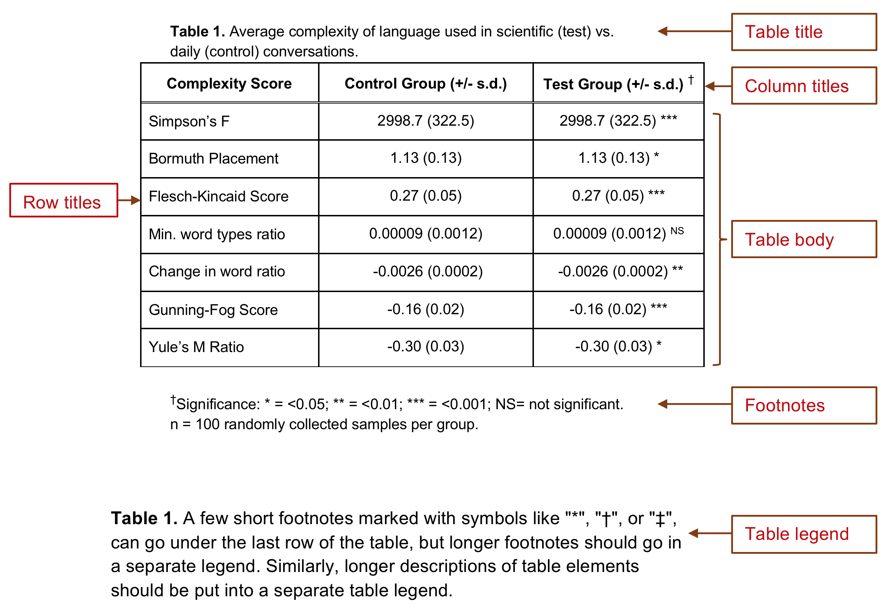
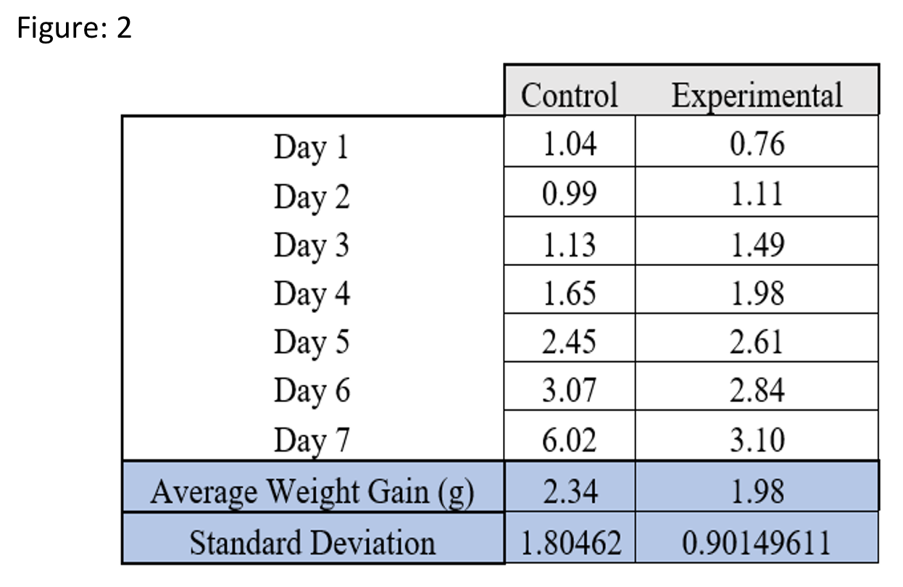
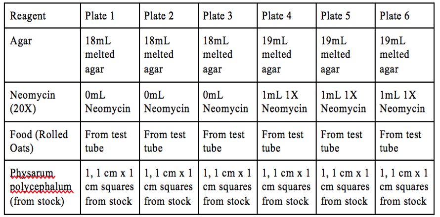
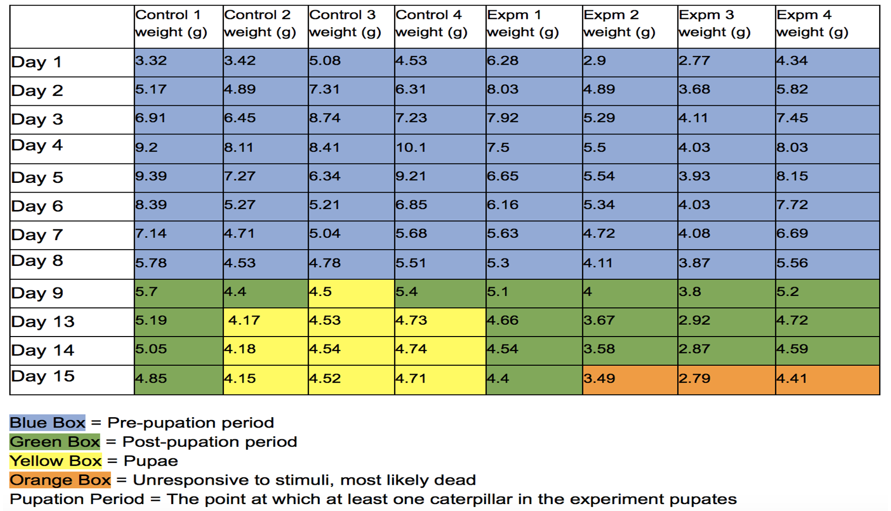
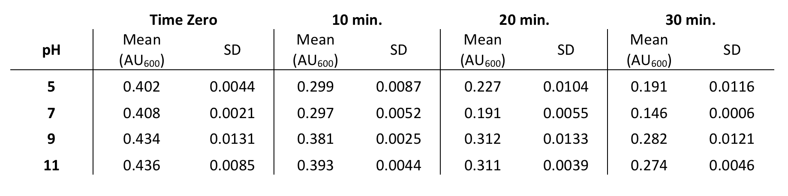

# Summarizing Data: Data Tables {#tables435} 

Students sometimes get confused when we say tables, and it is partly our fault, because there are TWO kinds. __Data collection tables__ are what you use to collect and organize raw data as you conduct an experiment. Your data collection tables are drawn in a paper-based lab notebook, entered in an electronic lab notebook, or created using MS Excel or Word. These tables contain unedited information that is meant for your use. You may be asked to turn in data collection tables as part of a class assignment. However a lab report should never contain raw unanalyzed data. 

__Data summary tables__ bring together the raw data points, summarize them in some way, and present the summary values or information so that another reader can make sense of the data quickly. All of the data tables in a lab report should present summarized data. 

{width=80%}

 

Each table should have a Table # and should be numbered in the order they are referred to in your text. You MUST reference each table in the text of your lab report. If you do not reference each table, readers do not know where to look for the data you are using to support your claims. 

Data summary tables should have neatly arranged rows and columns, and the data should be easy to read (not crowded). Clearly label the columns and rows of your table. Keep the column titles short. If longer titles cannot be avoided, use 1-2 word column titles in the table, then explain the column titles further in a separate table legend. 

A __SHORT__ (<1 line) descriptive title can be placed above the table itself. If a longer description of the table is needed, that information should go into a table legend. The table legend is like a figure legend in it explains details of the table that had to be left out to maximize legibility, and helps the reader interpret the table correctly. 

A few short footnotes, either numbered with a superscript or marked with symbols like "*", "†", or "‡", can go under the last row of the table, but longer footnotes should go in the table legend. 

Beyond these basic guidelines, there are innumerable ways to organize data summary tables. As you read scientific articles, pay attention to how they lay out their tables. Which ones make it easier to understand their argument or review their evidence? Those are the tables you SHOULD use as models. Which tables are hard to understand? Why? Those are examples of what you should NOT do.

## Creating More Effective Tables

These tips address the most frequent mistakes we see in our students' summary tables. 

* DO NOT include a table with all of your raw data observations.
* Be sure your tables are legible. Do not try to put too much data in a single table. Crowded tables are hard to interpret.
* The numbers are the most important part of the table. Make sure they are the most prominent element of the table. 
* Use the minimum amount of text you can. 

## Examples of Poorly Made Data Tables

### Example 1

__What Could Be Improved?__

1. This table presents the raw observations the author made. Averaging the weights over the 7 days does not change the fact this is raw data.
2. The table is misleading. It does not actually describe the caterpillars' weight __gain__, just the average weight over 7 days. 
3. The legend does not say what the experimental group has been treated with.
4. The legend calls this a figure, when it is a table.

 

### Example 2

__What Could Be Improved?__

We see tables like this one fairly often. The author is using a table to explain their methods. This is not bad on its own, but look at how much information is repeated. The table could easily be reduced to 3 columns: Reagents, Plates 1-3, and Plates 4-6. Or, the table could be eliminated entirely and this description included in the text of the Methods section.

 

### Example 3

__What Could Be Improved?__

At first this looks like a very informative table. However it has several things that need to be corrected.

1. The table contains raw, unsummarized data.
2. The dark fill colors make it hard to read the values in the table.
3. It is a table, not a figure.
4. Why is "Pupation Period" defined in the legend? Where is that used?

 

## Examples of Well-Made Data Tables

### Example 1

__What is Particularly Good?__

These data would have been better presented in graph form, but the author chose to present them as a table. Beyond that, it is a well-designed table. 

1. The average values are lined up so we can make direct comparisons easily. If we go down a column, we can see the trends at each time point.
2. The vertical lines create a clear separation between the data at the different time points.
3. The table caption explains the conditions under which the data were collected, and what the summary statistics represent. 
4. There is enough white space to make the numbers easy to read.

 

### Example 2

__What is Particularly Good?__

Like the previous example, this table summarizes some of the numerical data, and also includes the results of the comparison statistics. 

1. It is clear from the legend what the percent change represents.
2. The numbers are arranged so it is clear which numbers represent which subsets of the data. 
3. The table legend does not interpret the observations, only reports them.

 

### Example 3

This example began with the same data as Example 3 in the group of poor tables. We have reorganized and reformatted the same data so it is more informative and better presented. We also revised the figure legend.

![Figure 2: Daily weight gain of _Manduca sexta_ fed control diet vs. diet amended with AzaGard. Daily weights are reported as means for the 4 replicate animals in the control and experimental groups. Weight change from day zero was calculated separately for each animal by subtracting its initial weight from the current day's weight, dividing by initial weight, then averaging the values for the 4 replicates. "Break" indicates a gap in daily data collection when the labs were closed due to severe weather. Results of the statistical comparison of the control and treatment group are in the main text of the Results section.](images/Good_table3.png)

__What is Particularly Good?__

1. The table still shows the changes in weights over time, but only as summarized data (means and standard deviations). Readers can see more easily that, on average, control caterpillars reached an average of 8.95g at peak weight, while AzaGard treated caterpillars reached a lower peak weight of 6.28g.
2. The table adds a second data series that shows the __change__ in weights relative to Day Zero. This makes it easier for a reader to see that, by Day 3, control caterpillars had increased their weight by 126% over baseline, but AzaGard-treated caterpillars only increased their weight by 60% over baseline. 
3. The table legend says clearly where the reader can find the statistical comparisons between the groups.
4. They have not tried to hide the gap in the time series. They point out where there is a gap, and briefly say why.
5. The color coding has been removed entirely. That information was moved into the main text.
