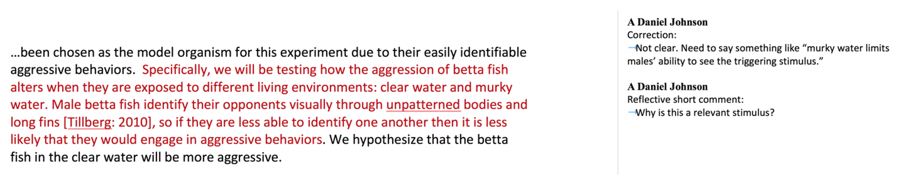

# Commenting on Reports {#commenting710}

## General Approach

From WAC/WID literature we know students improve more and faster if we:

* Limit the number of comments. Students only process and respond to a limited number of feedback items. Given too many comments, students tend to correct simple issues first and leave larger issues uncorrected.
* Focus on the largest problems first, then work down to smaller errors later. This reinforces the previous item and helps students improve faster.
* Ask questions that encourage reflection and self-evaluation. 
* Refer students to resources rather than provide direct correction. Students should develop a habit of seeking out their own answers instead of looking to us for them. This also reduces the amount of time spent writing the same comments over and over. 
* Do not copy-edit unless absolutely necessary. It is appropriate to point out where writing is vague or unclear, but not every instance. Students must learn to self-correct rather than expect someone will show them what to do every time. 

## We Aim to Give Feedback By Reflective Coaching, Not Copy Editing 

Reflective coaching comments have both specific information or guidance/rationale, and foster thinking. Often they have open ended questions that help a student think about BOTH WHAT TO CHANGE AND WHY. This approach is harder for students at first, but with practice students learn to self-correct the indicated error, and apply similar thinking to other situations.

This is an example of a front-page summary comment for a lab report. 

> This is good work on your first submission. You met all 5 of our basic criteria. The most important area to work on next is your discussion. Really think about resource allocation and herbivory, and your explanation. Ask yourself, is there another possible explanation besides herbivory? Also think about your results and what they’re really saying. Is there a better way to display or summarize the data that makes your main points clearer? Your writing was very clear; good work! There were some other minor technical points that also need correcting that I’ve highlighted. 

> Overall Score: Needs Minor Revisions.

Here is a breakdown the individual elements in the comment.

|Statements|Explanation|
|:--|:--|
|The most important area to work on next is your discussion. Also think about your results and what they’re really saying.|These two statements identify the first 2 points where the student should concentrate effort.|
|Really think about resource allocation and herbivory, and your explanation. Ask yourself, is there another possible explanation besides herbivory?|Student is prompted to think more about their initial explanation, and whether it is the only option. Note that the comment does not actually give alternatives, only points to a possibility.|
|Is there a better way to display or summarize the data that makes your main points clearer?|The prompt should be self-evident; there likely is a better option. The student can either look for a solution themselves, or talk with the instructor.|
|Your writing was very clear; good work!|Student does not need to focus on improving writing at this time.|
|There were some other minor technical points that also need correcting that I’ve highlighted.|Technical errors (statistics, figures) are the third major area needing correction.|
|Overall Assessment: Needs Minor Revisions.|Score aligns with description; report needs work mainly on interpretation of data, other smaller technical aspects.|

### Use In-Text Comments to Give Shorter Reflective Suggestions
The excerpt below from a student report has two comments for the same block of text. The first version is a simple correction. The second version invites deeper thinking.

Below are more examples of shorter reflective comments embedded in report pages. Read each comment. Try to identify the specific information or guidance/rationale, and how each comment encourages deeper thought.

* Did you mean for each leg before and after injection? Why is that important?
* What is the relevance of this observation in the moth life cycle?
* Are you sure it is the correct tense for this section? Check it in other primary lit.
* Did you find any primary literature articles that deal with interspecific interactions in betta fish? It would be very useful to cite and talk about those here, if there are.

In-text comments should be limited to 3-5 per page, & focus on basic criteria first, then the large global issues. Only focus on smaller details once basic criteria and global problems have been fixed.

### Limit the Number of Simple Copy-Editing Comments 

Copy editing comments explain how to correct a SPECIFIC location but give no rationale. They range from pointers (simple punctuation marks or single words indicating an error) to more specific instructions. They do not invite reflection or guide broader thinking, so any lessons learned do not transfer easily to other situations. 

Below are examples of copy editing comments, and how they could be modified to foster reflection. Several reflective versions (marked **) can be recycled with little or no revision and used in multiple situations.

|Correction-Oriented Comment|More Reflective Alternative|
|:--|:--|
|?? (could be interpreted many ways)|What is the purpose of this statement?**|
|Correct this scientific name, i.e., italicize or underline.|Is this correct format?**|
|No direct quotes – paraphrase|Are quotes allowed? How can this be presented more succinctly?**|
|Capital “P” here|What is standard format for reporting stats?**|
|Refer to Figure 1/Table 1 here.|Where are your references to each figure or table?**|
|Add/revise/remove a word, phrase, image, etc.|Add/revise/remove a word, phrase, image, etc., because ...|
|Ambiguous, awkward|I am not sure what this sentence means. Are you referring to X, or Y?|
|Methods should be past tense|Check articles we read previously for correct tense, format for this section.**|
|Raw data |Are these summarized data?|
|Avoid recipe style (with no further explanation)|Check articles we read for correct tense, format for this section.|
|Need units|What is required for all numbers? Is this correct format?**|
|Organize this section more clearly. Put X, then Y, then Z.|I’m not following your logic. Do you mean...?**|
|Clarify this step in procedure or analysis|I am not sure what this means. Do you mean X, or Y? Could someone with prior knowledge of this lab repeat what you did?**|
|Be more specific about how salinity changes root transport.|Focus in here. How so? What biological processes are happening due to salinity?**|
|I’m having trouble following logic here. Make sure your hypothesis is consistent with the rest of your introduction|I’m having trouble following your logic here. How could you revise the early part of the Intro so it leads to your hypothesis?|
|State here why plants allocate resources to leaves versus roots.|Be more specific. Why would they allocate resources to either structure?|
|Revise “changes over time” to say “changes in root growth per unit time.”|What does phrase “changes over time” mean? Root growth? Shoot growth? Something else?|
|No. Carbon allocation explains this more than any other nutrient.|What about carbon? Is R:S ratio showing carbon allocation more than other nutrients?|

### Reference the Resource Guide in Comments

Our Resource Guide is very thorough, but students are notoriously reluctant to use it. We reinforce that students should be referring to the Resource Guide FIRST by referencing specific pages in the Guide (especially for basic formatting and technical errors) instead of writing out detailed explanations as feedback comments. This also cuts down grading time.

|Correction-Oriented Comment...|...That Could Be a Resource Reference Instead|
|:--|:--|
|Report the stats in your results using (t=, d.f. =, P= ) format|See p. 48 of Resource Guide for how to report your stats results|
|Add your alpha value| |
|Report mean as x+s.d.| |
|Improper citation format. Use [Name: Year] in text.|Follow p. 36 of Resource Guide for in-text and end citation format.|
|This citation is not correct. We do not use URLs or DOIs only. You need to include authors, year, title, journal info.| |
|You need y-axis labels for this figure. Add a caption with an explanation of the measurements. Put caption in Figure Legends section.|See p. 41 of Resource Guide for format of axis labels, contents and location of caption.|

### If You MUST Address Basic Writing Mechanics

Sometimes basic writing is the biggest weakness of a lab report. Here is an example; this Introduction is so poorly written that it is hard to understand the student’s thinking:

> Organisms metabolism is fundamental in the ways that it is the sum of the chemical reactions that take place within each cell of a living organism that provide energy for vital processes and for synthesizing new organic material. The amount of energy expended by an animal over a specific period of time is referred to as a rate of heat energy released from an animal’s body (this procedure is known as calorimetry). However, measuring heat from an animal body with accurate precision requiring special equipment, which is often expensive. So, we measure rate that is controlled directly with heat production by oxygen consumption. 

> In an article published in 2000, K.A. Sloman set to exploring environmental factors and specific metabolic rate. The researcher carried out a study where he observed the effects of aggression on metabolism through the use of the brown trout (salmo trutta). Sloman placed a pair of the species in small, confined aquarium where he allowed one trout to establish a social hierarchy by becoming the dominant fish. He found that, other fish (subordinates) experienced high levles of soceity stress as a result of the aggression exhibited by the dominering trout. This led the smaller fish to have an increase in specific metabolic rate, which was measured through oxygen consumption (Sloman AK, 2000. Annals Biol. 34:15-17). This experiment is similar to our own as we wish to test the effects of aggression on the specific metabolic rate. In order to do this, we will use crayfish (orconectes sp.). We will carry out this experiment with the following hypothesis in mind: a crayfish is exposed to aggression/social stress should have a significant increase in specific metabolic rate.

It is hard to address so many errors using just reflective coaching and references to other resources. Adding to the challenge, the entire report likely needs detailed corrections, not just these two paragraphs. We do not expect GTAs to spend time copy editing entire reports. Instead, we recommend they use one of these two strategies for responding to writing mechanics problems. 

__Option 1:__ highlight the one poorly written paragraph, and attach a new comment. List the specific errors that you see. Be sure to tell the student that you saw similar errors in other paragraphs, and that they are responsible for finding and correcting them. For example, the feedback comment for the flawed paragraph above might read:

> You have a lot of basic writing flaws in your report that you need to correct or revise. For example, I found all of these basic errors in just these two paragraphs:
* Unclear flow of the logic in both paragraphs
* Errors in grammar (example: "Organisms metabolism is fundamental in the ways that it is the sum..." 
* Awkward wording, run-on sentences (ex. "The amount of energy expended by an animal over a specific period of time is referred to as a rate of heat energy released from an animal’s body (this procedure is known as calorimetry)." 
* Improper word usage (ex. dominant, not domineering)
* Improper citation location and format (look at Sloman reference.)
* Format errors in scientific names
* Spelling errors (ex. levles of soceity)

> You need to revise this report very carefully. I recommend that you contact the Writing Center in the library first. They can help you with basic writing issues. After meeting with their tutors, make an appointment with me to work on how you could better organize your logic and key points. 

 

__Option 2:__ use minimal marking. Edit one paragraph thoroughly for grammatical errors. Then attach a comment in the margin telling the student they are responsible for fixing similar errors beyond this paragraph. [You can learn more about minimal marking here.](www.csuchico.edu/ge/faculty/writing_intensive_u/responding_to_writing/responding_to_surface_errors.shtml)

## Other General Suggestions When Giving Feedback

* Provide some positive encouragement or praise when warranted, but do not over-state it, or give undeserved praise. 
* If one particular item was done well, refer the student to it as an example of how to correct other parts of the report. 
* Avoid “but.” Think about this comment: “I like how you wrote your Intro, but the Methods need…”. The “but” negates what the student did well. Try wording that invites continued effort: “I like how you organized your Introduction. For the revision, try using the same organizational strategy for your Methods section, which needs…”. 
* Do not interject writing conventions and idioms of your disciplinary sub-field. For example, our students are not required to use different formats for in-text citations, depending on the number of authors on the source article. These details become important later as students specialize; at the introductory level we want them to focus on fundamental writing issues. 
