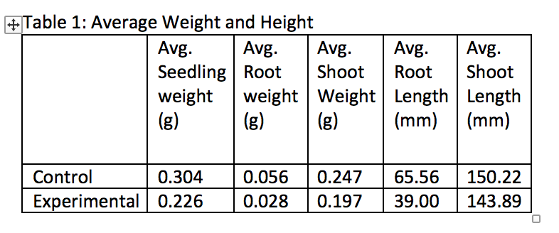
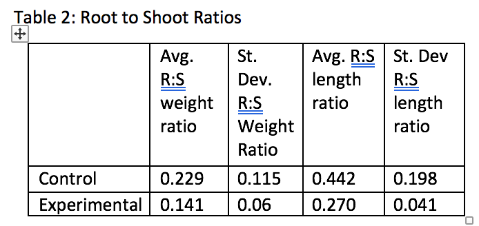
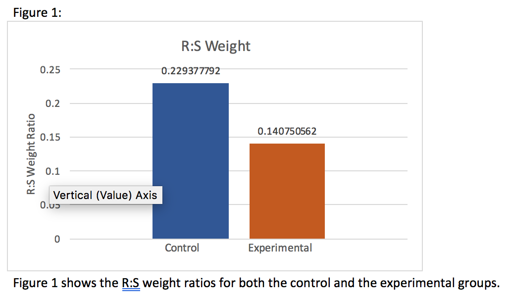
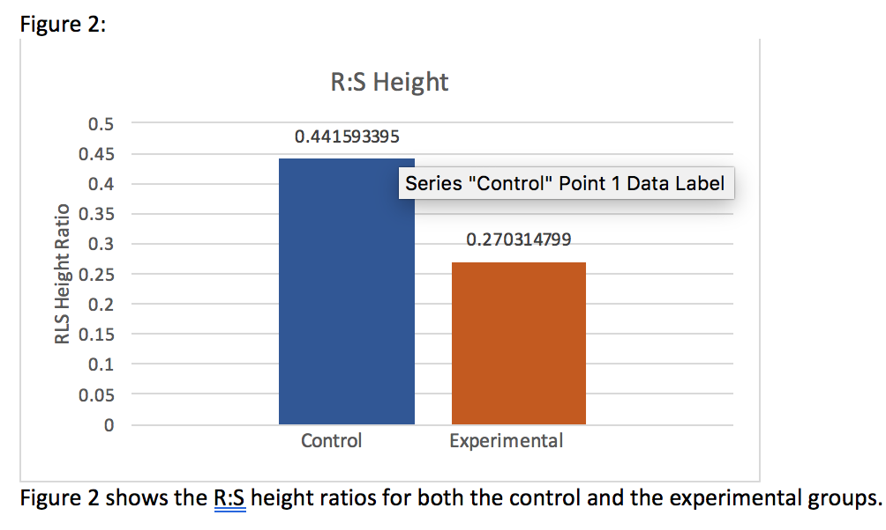
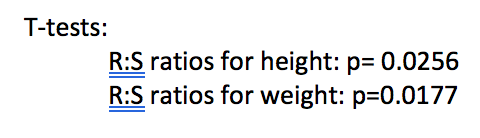
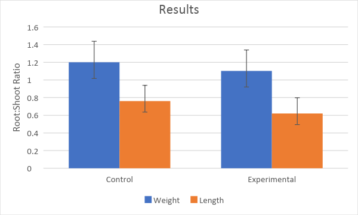

# Lower Quality Sample Ecology Reports {#appa813}

__Note to Instructors:__ these two reports have been reproduced essentially as they were submitted by the original student authors. We have not corrected misspellings or grammar, nor filled in missing information.

## Example Report #1 {-} 

### Title {-}

Herbivory decreases root to shoot ratios of Pisum sativum subsp. arvense

### Abstract {-}

In this study, we tested the effect of herbivory on Pisum sativum subsp. arvense. Herbivory is a plant eating behavior exhibited by animals, and is an important part of the environment that plants are exposed to. Plants respond to their environment through things like resource and energy allocation, where more energy and resources may be spent on some aspects of life than on others. We hypothesized that the leaf damage caused by the imitated herbivory would cause the plant to allocate more resources to leaf repair and shoot growth than to root growth. We imitated the herbivory by punching a hole in each leaf of the experimental group after allowing them to grow for about twelve days, and allowed them two days to recover. At this point, we harvested some seedlings and determine a root to shoot ratio for height and one for weight for both the experimental and control groups. Our results found that the plants allocated more energy to shoot growth and leaf repair than to root growth, and the root to shoot ratios for both height and weight were significantly lower in the experimental group than the control group. Thus, our results supported our hypothesis. 

### Introduction {-}

In this experiment, we investigated resource an energy allocation in plants. Plants adapt to their environments by allocating more or less energy to various areas. One way to measure this allocation is thought root vs. shoot growth, specifically the length and weight of each.

The specific environmental characteristic that we tested is the effect of herbivory on field pea growth. Field peas are a fast-growing plant, with long stems, roots and large leaves on seedlings. Each of these characteristics was important for our experiment, as we only grew the plants for two weeks. Additionally, long stems and roots increases the average root to shoot ratios for height and weight when compared to those of smaller plants. This larger value will allow us to more easily detect differences between the study groups, as we won’t be dealing with single milligram or millimeter values. Lastly, we needed our plants to have large leaves for seedlings, as we were studying herbivory.

According to Alison N. P. Stevens, “herbivory is the consumption of plant material by animals.” [Stevens:2010] In response to herbivory, some plants have developed defenses. Some physical defenses include thorns or spikes, while chemical defenses may include compounds like cocaine or nicotine [Coley and Barone: 1996]. Herbivory can affect plants in a variety of ways. In some ways, herbivory is detrimental to the plants, as they may be killed off entirely, or their growth or reproduction could be limited by leaves or fruits and seeds being eaten. However, herbivory may also aid plants, as it may help disperse seeds and decrease competition. [Prins and Nell: 1990]

We mimicked this behavior by using a hole-punch to take a section of each leaf out of the experimental group. We compared the root to shoot ratios for height and weight for both the experimental and control groups using a two-tailed t-test. We predicted that the plant would direct more resources towards shoot growth to recover from the herbivory. This behavior would help ensure that the leaf has enough surface area for transpiration and sunlight collection in response the leaf-loss from the herbivory.

### Materials and Methods {-}

Gather approximately 200 grams of field pea seeds. Soak them in room temperature water for approximately ten minutes. Gather six individual plastic planting containers, and separate into two groups of three on a planting tray with holes for draining.  Fill the planting containers with vermiculite and water until the vermiculite is damp. Spread the soaked seeds evenly over the wet vermiculite and pat into the soil slightly. Cover the peas with dry vermiculite and water again to dampen the soil. Label each side of the planting tray to ensure differentiation between the control and experimental groups. Place the tray in a greenhouse with equal access to light and allow to grow. Plants should be watered every two days using a typical watering can. Each planting container should be watered for three seconds each time it is watered. Allow the plants to grow for two weeks, and on the twelfth day, use a hole punch to take one hole out of each leaf in the experimental group. 

After two weeks, remove three seedlings from each of the planting containers, totaling nine seedlings from each group. Ensure that the entire root is being removed with the seedling when it is removed from the soil. Rinse any excess vermiculite from the seedlings with water, and pat dry. Weight the seedling as a whole, and record the weight. Use scissors to cut between the shoot and the root, and the point where the stem changes colors. Weigh the root and record. Calculate the weight of the shoot using the total weight and the weight of the root. Measure and record the maximum length of the root and the shoot for each seedling. Calculate the root to shoot ratio for height and the root to shoot ratio for weight. Calculate the mean weight of the whole seedling, root, shoot and the mean length of the root and shoot for the control and for the experimental group. Calculate the standard deviation for these values as well. Use two-tailed t-tests to determine the difference between the mean root to shoot ratio for weight for the two groups, and between the mean root to shoot ratio for the height of the two groups. 

### Results {-}

Overall trends of the data were that the root to shoot ratios for height and weight were larger than those of the experimental group, as seen in Tables 1 and 2, and Figures 1 and 2. According to our two-tailed t-tests, the differences between our groups for both root to shoot ratios of height (p=0.0256) and weight (p=0.0177) were statistically significant, as the corresponding p-values for each were less than 0.05.

### Discussion {-}

Our results supported our hypothesis, which was that the plants in the experimental group would spend more energy on shoot growth than on root growth. The extra energy allocation to the shoot growth would therefore stunt the root growth, causing the root to shoot ratio to be low for both height and weight, as was the case in our experiment. 

In the beginning of paper, we discussed how plants allocate energy and resources to different things in response to their environment. According to our results, plants that are subject to herbivory allocate more resources to the shoots than to the roots. This can be explained by the plant halting root growth and using the energy it would have been allocating to roots to help repair the damaged leaves. Repairing the leaves is important for the plant, as without enough leaf surface area, transpiration and the capturing of carbon dioxide and sunlight are all negatively impacted. Without transpiration, carbon dioxide or sunlight, the plant cannot make enough energy for it to thrive and reproduce, or perhaps even to survive. 

This is supported by Prins and Nell, who found that herbivory can positively or negatively impact plants, depending on where they are in their life and reproductive cycles [Prins and Nell: 1990]. 

Possible sources of error in this experiment are generally due to human error. When removing the seedlings from the soil, although we were careful, it is possible we broke the roots and left some of them in the soil. Additionally, we imitated the herbivory with the hole-punch later than intended, as we originally wanted to imitate this behavior three days after the seedlings sprouted, as it would allow the leaves to be not completely removed by the whole punch, but would also allow the plant more days to recover from the leaf damage. 

Future steps for this study could be to determine if extent of herbivory has a different effect on plant growth. For example, altering the amount of leaves removed between groups. Additionally, the herbivory could be repeated over long periods of time with time allotted for recovery in between. 

Increased knowledge on herbivory and how it affects plant growth and resource allocation could be important information to aid agriculture and deforestation. If we know that plants generally are not affected by herbivory after a certain point in their growth cycle, we could transplant different species of plants into an area affected by deforestation at certain points in their growth cycle in order to help ensure their survival. Additionally, if we know how plants are affected by herbivory, agriculturalists could alter their strategies to adapt to this. For example, instead of pesticides, growers could use netting to keep animals away until a certain point in the plants’ life cycle where herbivory is no longer as detrimental to their growth. If future studies were done on the positive effects of herbivory for plant reproduction, farmers could use this information for help with seed dispersal and would have to do less planting. Overall, herbivory is a large part of the environment that plants must adapt to, and knowing as much as possible about how it affects plants throughout their life could help us be more efficient and productive in agriculture and regrowth after deforestation. 

### Literature Cited {-}

1. Stevens, A. N. (2010). Predation, Herbivory, and Parasitism. _The Nature Education: Knowledge Project._ Retrieved October 14, 2017.

2. Coley, P. D. & Barone J. A. Herbivory and plant defenses in tropical forests. _Annual Review of Ecology and Systematics_ 27, 305-335 (1996). 

3. Prins, A. H., & Nell, H. W. (1990). Positive and negative effects of herbivory on the population dynamics of Senecio jacobaea L. and Cynoglossum officinale L. _Oecologia,_ 83(3), 325-332. doi: 10.1007/bf00317555

### Figures {-}

{width=50%}

 

{width=50%}

 

{width=50%}

 

{width=50%}

 

{width=50%}

 

### Figure Legends {-}

Figure 1 shows the R:S weight ratios for both the control and the experimental groups. 

Figure 2 shows the R:S height ratios for both the control and the experimental groups. 

### Notes For Instructors {-}

#### Primary Points to Focus On First {-}

* The author provides a reasonable explanation for their hypothesis, but do not use any of the literature sources to back it up.
* The methods are directly copied from the steps in our laboratory manual. In addition to being plagiarized, they are not in past tense.
* The final paragraph of the Discussion section is not really integrated into the rest of the report, and is not supported by any literature sources.

#### Other Points of Concern {-}

* Tables 1 and 2 could be combined, and are not formatted appropriately.
* Figures 1 and 2 do not have standard error bars, and there is text hiding parts of the data.
* Figure 3 is not needed. The results of the statistical analysis should have been reported in the main body of the text. 
* The reference [Stevens: 2010] is not primary literature.
* There is no need to include a "sources of error" paragraph.

 

 

## Example Report #2 {-}

### Title {-}

The Allocation Patterns of Pisum sativum when Grown within Herbivorous Conditions

### Abstract {-}

For this experiment, Pisum sativum plants were put under herbivorous conditions, and their allocation patterns were studied.  Pisum sativum plants are also known as field peas, and they are commonly grown throughout Northern temperature regions. The hypothesis being tested is: will the plants being exposed to herbivorous conditions attempt to grow larger roots so that they can compensate for the loss of resources due to shoot loss? Every plant is exposed to some sort of predator.  This experiment consists of simulating plant predation upon the Pisum sativum plants.  Under these conditions, the growth of the roots and shoots were analyzed.  The data that was collected in relation to the root:shoot mass was insignificant, but the data describing the root:shoot length was significant.  However, the experimental group’s roots did not grow to be any larger than the control group’s roots, so the hypothesis was rejected.  

### Introduction {-}

Evolution has made it so that plants will adapt in order to survive in the environmental conditions that  are present around them.  If Pisum sativum can successfully adapt to its environment, it will be able to sustain its life, and live long enough to produce offspring.  However, if it fails to adapt, it will simply die, due to the hazardous environmental conditions.  Allocation is a crucial process used to adapt.  Allocation is the way in which an organism distributes its resources to best suit its environment.  For example, if a plant needs to produce more energy via photosynthesis, the plant will need to allocate more resources towards making leaves [Johnson 15-19].  

The plant species that is being tested is entitled Pisum sativum.  This species of plant is also known as field peas, and they are commonly grown throughout Northern temperature regions.  In this experiment, we are attempting to simulate hostile environmental conditions.  The experimental plant group will be under herbivorous conditions, and the plants must adapt to these conditions in order to survive.  Herbivory is hazardous to the Pisum sativum plants because  it reduces the plant’s primary structures for photosynthesis, the leaves.  To create this herbivorous environment, we will simulate the plant being eaten by insects.  Therefore, the hypothesis is that the experimental plant group will attempt to grow larger roots so that they can compensate for the loss of resources due to shoot loss.

### Materials and Methods {-}

The experiment was designed so that there were two groups: the control group and the experimental group.  The experimental group was exposed to the herbivorous conditions.  To simulate herbivorous conditions, every three days, 1/2 of each leaf was cut off, and this occurred for two weeks.  The control group was not exposed to these hostile conditions, but each group was given the resources that they needed in order to carry-out regular plant functions: water, sunlight and soil.  After each group of plants had been given two weeks to grow, 12 plants were taken from the control group and 12  plants were taken from the experimental group.  To separate the roots from the shoots, each plant was washed off and cut right above the gametes.  Each root and shoot was measured in centimeters and weighed in grams .  With these measurements, we calculated the root to shoot ratios of both plant groups.  The data was then collected, recorded, and analyzed in the form of a two-tailed t-test.  

### Results {-}

The data of the experimental group and the control group are similar, in relation to mass (t-value= 1.13, d.f.=22, p=0.14).  The weights of the experimental and control groups only differ by a factor of about 0.1g (Figure 1).  The lengths of the experimental group and control group has proven to have a significant difference (t-value= 2.24, d.f.= 22, p=0.02).

### Discussion {-}

While the t-test proved that there was a significant difference between the length of the control group’s roots and the experimental group’s roots, the roots of the control group were, on average, longer than the roots of the experimental group’s roots.  This data does not support the hypothesis because, the hypotheses expected for the roots of the experimental group to grow longer, due to the herbivory.  However, the roots of the experimental plants were significantly shorter than the roots of the control plants (Figure 1).  This indicates that Pisum sativum plants do not respond to having their leaves eaten  by herbivores by growing larger roots.  Therefore, the hypothesis was rejected, and the plants may have some other biological process that allows them to adapt to herbivores eating their leaves.  For example, it is possible that the plants are allocating more resources towards making more leaves rather than growing their roots.  This would help to explain why the experimental group plants have shorter roots than the control group plants.  

This experiment observed the allocation of Pisum sativum resources in reaction to herbivory, and it treated herbivory as if it was only a negative environmental factor in relation to the plant.  However, according to a research study entitled “The effect of insect herbivory on the growth and fitness of introduced Verbascum thapsus L.”  It is actually possible for herbivory to have positive effects on plant growth.  Therefore, this same experimental process could be carried out, but the hypotheses could centralize around the positive effects of herbivory and not the negative effects [Wilbur, Alba, Norton, Hufbauer].

### Literature Cited {-}

1. Johnson AD. Resource Allocation in Plants. _Ecology and Evolution Laboratory Manual_.  Dept. Biology, Wake Forest University, Winston-Salem, NC.  Vers. 18.2 (updated August 3, 2018), pp. 15-19.  

2. Wilbur HD, Alba CA,  Norton AP, Hufbauer RA.  2013.  The effect of insect herbivory on the growth and fitness of introduced Verbascum thapsus L. _NeoBiota_.  19: 21-24.  

### Figures {-}

{width=50%}

 

### Figure Legends {-}

Figure 1 

### Notes For Instructors {-}

#### Primary Points to Focus On First {-}

* Both the Introduction and Discussion need more supporting literature. What background was the study based on? 
* The Discussion is too simple. The author reports they rejected their original hypothesis, but did not try to say anything about why their original hypothesis was incorrect. 
* Both the Introduction and Discussion have two nearly unrelated paragraphs. How are the concepts connected within each section? How does the Discussion tie back to the Introduction?

#### Other Points of Concern {-}

* The description of the methods used to simulate herbivory could be more precise. As written it seems like the test plants were clipped every day, which would have been fatal.could be more precise. 
* The figure should be rearranged to put length measures together, and weight measures together. As presented, they are too hard to compare.
* The figure legend is too short. 
