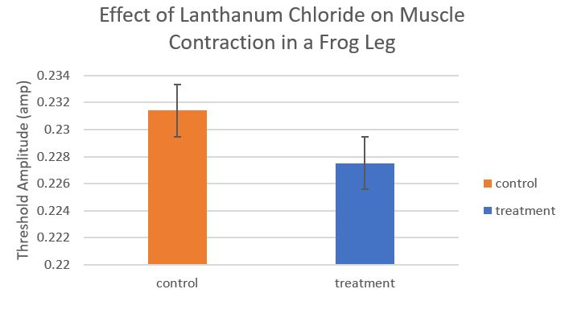

# Higher Quality Sample Physiology Reports {#appb823}

**Note to Instructors:** these reports have been reproduced essentially as they were submitted by the original student authors. We have not corrected misspellings or grammar, nor filled in missing information.

## Example Report #1 {-} 

### Title {-}

Effect of lanthanum chloride on contraction of gastrocnemius muscle in Rana pipiens

### Abstract {-}

In this study we injected lanthanum chloride (LaCl3) to prevent the gastrocnemius muscle from contracting in Rana pipiens. We hypothesized that LaCl3 would stop muscle contraction because LaCl3 blocks calcium channels muscle fibers. The Ca channels are necessary for muscle contraction because they trigger the movement of acetylcholine filled vesicles. These vesicles fuse with the cell wall and release their contents and activate other processes that allow muscles to contract. We used the legs of Rana pipiens to measure contraction after LaCl3 injection. The legs are controled by the gastrocnemius muscle and the sciatic nerve. We exposed the muscle and used pin electrodes to measure the contraction in the legs twice, once before injection and once after. Then we averaged the results of the two tests and ran a 1 tailed paired t-test. This indicated that we found a significant difference in the contraction levels before and after injection. 

### Introduction {-}

The legs of Rana pipiens are controled by the gastrocnemius muscle and the sciatic nerve. When stimulated with electricity, the leg will twitch and contract. Muscle contraction is due to an action potential that opens calcium ion channels. These Ca ions trigger the movement of acetylcholine filled vesicles to bind with the membrane of the neuron. ACh is released to bind in the synaptic cleft, opening sodium ion channels that depolarize the cell, causing an action potential (Ebashi and Endo: 1968). Lanthanum chloride is a compound that inhibits the opening of calcium channels. This would prevent the vesicle movement and keep ACh from being released into the cleft, preventing the opening of sodium ion channels and thus stopping an action potential from occurring. In this experiment, we plan to inject LaCl3 in the gastrocnemius muscle. We hypothesize that if LaCl3 is injected into the muscle, the contraction will not occur. 

### Materials and Methods {-}

To perform our experiment we used LaCl3, 3 Rana pipiens legs, a syringe, and software to measure contraction. In order to expose the muscle, we skinned the leg. Once the muscle was exposed we suspended the leg from a ring stand with a force transducer and stuck the electrode pins into the muscle and stimulated at a variety of amplitudes. After we found control results, we injected the LaCl3 into the muscle and waited for it to diffuse evenly. We repeated the measurements for the experimental and then ran a 1 tailed paired t-test to see if our results were significant.

### Results {-}

We found that the LaCl3 increased contraction in the first leg and decreased in legs 2 and 3. When injected with LaCl3, leg 1 started contraction at only 0.2v, but legs 2 and 3 did not begin contracting until 1v and 0.4v respectively. The averages of these results are shown in figure 1. Figure 1 shows that in general, contraction went up after LaCl3 was added. The results of our 1 tailed paired t-test were (Degrees of freedom: 8, t-value: 3.95, p-value: 0.00424). The results were significant.

### Discussion {-}

We hypothesized that if LaCl3 is injected into the muscle, the contraction will not occur. Although contraction was lowered significantly in legs 2 and 3, results from leg 1 indicated a large increase in contraction. Leg 1 refuted our hypothesis, but legs 2 and 3 supported it. Leg 1 having such a large increase is most likely due to error. When we tested leg 1 we had the pins in the wrong part of the muscle. Other than the main source of error, other error could have occured from different innate muscle contraction ability. It is difficult to compare different legs because they could be of different strengths. This error affected our averages, indicating that contraction increases when LaCl3 is injected, causing our p_value to be under 0.05, but for the wrong reason. When looking at the results from legs 2 and 3, it can be seen that the LaCl3 may have plugged the calcium channels and kept the acetylcholine filled vesicles from binding with the cell membrane. If this occurred, it would prevent muscle contraction because acetylcholine could not be released into the synaptic cleft. However, contraction still occurred in legs 2 and 3, indicating that amplitude could play a role in forcing muscles to contract. It could possibly do this by forcing the voltage gated channels open, and allowing calcium to trigger the vesicles to bind with the membrane. This information can be useful in situation when someone would need to either stop Ca channels or reduce muscle contraction for any reason such as paralyzing someone for medical reasons.

### Literature Cited {-}

Ebashi, S., and M. Endo. “Calcium and Muscle Contraction.” _Progress in Biophysics and Molecular Biology_, vol. 18, 1968, pp. 123–183., doi: 10.1016/0079-6107(68)90023-0.s 

### Figures {-}

{width=50%}

 

### Figure Legends {-}

Figure 1. The experimental group had a higher average contraction at all amplitudes.

### Notes For Instructors {-}

#### Primary Points to Focus On First {-}

* Introduction is a random series of statements with no connecting logical flow. Literature source is simply tacked on.
* The reasoning behind the hypothesis is missing from both the Introduction and Discussion. 
* Figure 1 does not have axis titles or any explanation of what is shown. It is impossible to interpret as presented. Also, there are no standard error bars on the data.

#### Other Points of Concern {-}

* Methods are a list of steps, not a narrative.
* Abstract is fragmented and does not flow from background to experiment to interpretation.
* There are no cited literature sources to support the Discussion.

 

 

## Example Report #2 {-}

### Title {-}

The Effect of a Calcium Channel Blocker on Muscle Contraction in a Frog Leg

### Abstract {-}

Muscle contraction is an intricate process that is dependent upon many different ions to spark action potentials. Manipulating different ion concentrations allows us to better understand the process. In this experiment, we are inserting lanthanum chloride, a calcium channel blocker, into the gastrocnemius muscle of a frog leg to see its effect on threshold amplitude. Because lanthanum chloride is a calcium channel blocker, calcium will have a difficult time being released from the sarcoplasmic reticulum, and action potentials will be scarce. We hypothesized that the lanthanum chloride would produce a higher threshold amplitude. In order to determine the threshold amplitude, we used a computer software program. We calculated the threshold value three separate times for both control and both treatment groups. After gathering all the data from the class, we completed a two sample t-test. It produced a P-value of 0.96. This P-value indicated that the groups are not significantly different. 

### Introduction {-}

The muscular system of a species’ body is largely dependent upon the neuromuscular system. The contraction, or movement, of the muscles require action potentials. For an action potential to occur, acetylcholine, a neurotransmitter released due to nerve impulses at the neuromuscular junction, must be released from the presynaptic terminal. The binding of acetylcholine to its receptor site on the muscle fiber then causes sodium channels to open and a resulting action potential to occur [Queensland Brain Institute: 2017]. The action potential then travels throughout the muscle, where it reaches the sarcoplasmic reticulum, a calcium storage unit within the muscle, and calcium is released, and the muscle fiber is able to shorten, or contract [Rüegg: 1992]. 

The ions such as sodium and calcium are extremely important in the function of the neuromuscular system. Calcium ion concentration, in particular, is very important in the contraction of muscles [Excitation Contraction Coupling, http://muscle.ucsd.edu/musintro/ecc.shtml]. In order to understand the effects of their absence in this system, in this experiment we will add lanthanum chloride, a calcium channel blocker, to the gastrocnemius muscle of the frog leg. How will the muscle respond to the addition of this calcium channel blocker? Will the threshold be increased or decreased? We hypothesize that, as the lanthanum chloride is added, the threshold value will be increased. We hypothesize that, because some of the calcium channels will be blocked, calcium will not be able to be released and cause an action potential as quickly as if the calcium channels were open, yielding a higher threshold value in the treatment leg. 

### Materials and Methods {-}

To test the effect of a calcium channel blocker on the gastrocnemius muscle of a frog, we used syringes to administer the lanthanum chloride. We used a control group to compare the myograms of the treatment groups. Upon collecting the data, a statistical t-test was used to compare the average threshold values between the two groups. 
We first obtained two frog legs. The dissection procedure was the same for both the control and treatment leg. We labeled one leg as the control and the other as the treatment.

We dissected the frog leg, separating the top portion of the gastrocnemius muscle from the bone. We then attached a piece of thread around the top portion of the muscle and looped it around the hook hanging down from the FT-302 transducer. We made sure there was enough tension in the thread so that the muscle was standing straight up. We cut two small pieces of the silver thread and tied each around the muscle in two different locations, one towards the top and one towards the bottom of the muscle. We then attached the probes to the thread in the two different locations. Using the computer software program, we determined the threshold value by starting at an amplitude value of 0 and increased in small increments. The smallest value at which the muscle contracts was the threshold value. We recorded the threshold three separate times, each time starting at a threshold of 0. Since we only had two frog legs, we performed the control and treatment procedure on both legs. After determining the threshold values with no blocker administered, we added 0.1 ml of lanthanum chloride to the gastrocnemius muscle, inserting the syringe at an angle into two different locations on the muscle, one towards the top and one towards the bottom. We then waited ten minutes before repeating the process of determining the threshold value three times using the computer software system. 

### Results {-}

The bar graph shows that the control group had a higher threshold amplitude than did the treatment group. These values were determined by averaging the data collected from the two sections combined. To interpret this data, we performed a two sample, one tailed t-test. This gave us a P-value of 0.96.

### Discussion {-}

A P-value of 0.96 is much larger than the ideal P-value of 0.05. This large P-value indicates that the groups are not statistically significantly different. This shows that there may have been other factors affecting the threshold amplitude, rather than the presence of a calcium channel blocker. The treatment group has a lower average value of threshold amplitude than the control group, showing the opposite of what we predicted. This causes us to have to reject our alternate hypothesis and accept our null hypothesis, stating that lanthanum chloride did not have a significant effect on threshold. 

### Literature Cited {-}

1. Action Potentials and Synapses. March 26, 2018. <https://qbi.uq.edu.au/brain-basics/brain/brain-physiology/action-potentials-and-synapses>.

2. Rüegg, J.C. 1992. Calcium in Muscle Contraction: Cellular and Molecular Physiology.

3. Excitation Contraction Coupling. March 26, 2018. <http://muscle.ucsd.edu/musintro/ecc.shtml>.

### Figures {-}

{width=50%}

 

### Figure Legends {-}

Figure 1. Bar graph showing the effect of Lanthanum Chloride on muscle contraction in a frog leg.

### Notes For Instructors {-}

#### Primary Points to Focus On First

* The Introduction makes broad over-generalizations about neuromuscular physiology. The system in vertebrates is not the same as the one in invertebrates.
* The reasoning for the hypothesis is flawed. Calcium release is the product of an action potential, not the cause.
* None of the sources cited are allowed types, and there are no primary sources supporting the discussion. Ruegg, 1992 might be acceptable if properly cited, but as written it is impossible to tell where the original source comes from. Web sites may not be used in place of primary literature sources.

#### Other Points of Concern {-}

* The Abstract is disorganized.
* In the Results, the statistical outcome was not reported correctly.
* The discussion does not talk about any reasons why their original hypothesis was not supported.
* The figure legend is not sufficiently detailed to interpret the results shown.
