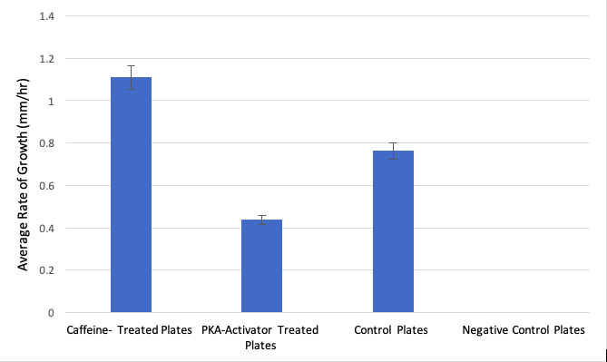
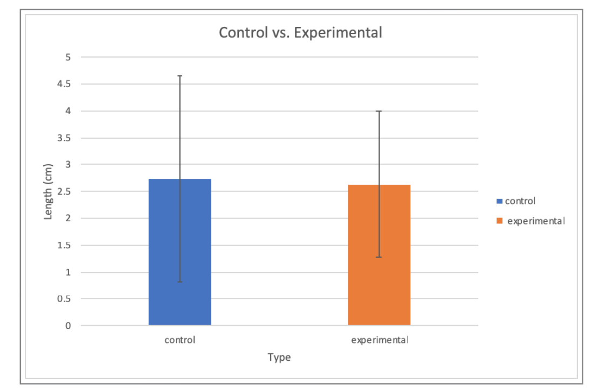

# Higher Quality Sample Cell Biology Reports {#appc835}

## Example Report #1 {-} 

### Title {-}

The Effects of Caffeine on Chemotactic cAMP and PKA Signaling Pathways in Physarum polycephalum

### Abstract {-}

Chemotaxis is a cellular process that involves the movement of a cell or an organism in a direction corresponding to increasing or decreasing concentrations of a particular chemical(s). We hypothesized that the highest rate of chemotaxis of Physarum towards food would occur in the presence of caffeine plus the Protein Kinase A activator dibutryl-cAMP. The results of the experiment showed statistically-insignificant, yet stark differences in the extent of chemotactic rates (physical distance traveled over time) of the caffeine-treated replicate samples, supporting our hypothesis, but not allowing us to reject the null hypothesis for this experiment.

### Introduction {-}

Chemoreception is an integral part of the organismal ability to assess and adequately respond to its ever-changing environment. Chemotaxis is the simplest form of chemoreception in which motile cells move towards or further away from a chemical stimulus [Ueda: 1975]. Organisms lacking a nervous system undergo chemotaxis, sensing and responding to their environments via intracellular signal transduction pathways. One of those pathways is the cAMP-dependent G-protein coupled receptor pathway. cyclic-AMP (cAMP) turns on the enzyme protein kinase A (PKA). PKA in turn phosphorylates many other enzymes that control motility. 

It is important to understand the process behind environmental chemical stimuli’s ability to trigger chemotaxis. Previous research has been inconclusive on adenylate cyclase’s (found in the cellular membrane and activated by cAMP) involvement in the intricate and still-puzzling communication system of the slime mold [Smith: 1978]. 

Our experimental objective is to better understand the machinery behind the cAMP-mediated pathway, and the roles of cAMP and PKA in chemotactic rates of Physarum polycephalum. We specifically focused on caffeine’s effects because it blocks breakdown of cAMP by inhibiting phosphodiesterase. We hypothesized that the greatest significant difference in the extent of chemotaxis (as measured in the greatest rate of growth in millimeters per hour by the organism) would occur in an experimental group in which agar plates were saturated with caffeine solution. 

### Materials and Methods {-}

The general plan for this experiment was to use 3 agar plates without caffeine solution, but with food (oatmeal inserted into an incision in the agar layer) as contros, 1 plate with neither caffeine, nor food, nor PKA as the negative contro, 3 plates with caffeine and food as the first experimental treatment group, and 3 plates with dibutyryl-cAMP and food as the second experimental treatment group. 

Ten, 2% agar petri plates were used in this study: 3 for control, 3 for caffeine treatment, 3 for dibutryl-cAMP treatment, and 1 for a negative control. Plates were soaked in 10 ml each of either 10 mM caffeine, 1 mM db-cAMP, or distilled water for 10 minutes, then all excess liquid was removed. 

When plates had dried, 3, 1-cm2 blocks of Physarum polycephalum were transferred to pre-cut holes in the middle of each plate from actively growing stock plates using a sterile metal spatula. Then 5-6 flakes of raw oatmeal were placed on the outisde edge of the plate to provide a source of chemotactic signal.

Each lid of each plate was taped down to hold it in place and all plates were entirely wrapped in foil, then placed into a dark drawer overnight (18-24hrs). Distance traveled by Physarum from each starting block was measured with a ruler. Distances traveled were averaged for the 3 plates in a group. The statistical significance of our results was measured via a two-tailed t-test, comparing the chemotactic growth means of the treatment groups (caffeine and PKA) to the control group mean. 

### Results {-}

Figure 1 shows a bar graph comparing the average growth rates of all experimental groups over a time span of 24 hours.

The sample with no food, no caffeine, and no db-cAMP (negative contro) showed no signs of quantifiable growth whatsoever. Compared to control (food-only) plates, caffeine-treated Polycephalum samples sprawling out faster by an average of 0.35 mm/hour faster than the controls after 24 hours. When compared against the control samples, the results of the growth rate of the caffeine-treated samples were observably greater, yet did not prove to be statistically significant (p-value: 0.1518, >0.05, t-value: 1.767, d.f. = 4). 

In comparison to the db-cAMP treated group, the caffeine treated group showed a greater rate of growth, with caffeine-treated Polycephalum samples sprawling out faster by an average of 0.67 mm/hour than the db-cAMP samples. Even though the db-cAMP-treated group showed slower chemotactic growth rate on average than both the caffeine-treated group and the control group, with an average growth of 10.5mm over 24 hours (growth rate = 0.44 mm/hr), the rate still was not significantly less than the control group (p-value: 0.1549, > 0.05, t-value: 1.752, d.f. = 4). 

### Discussion {-}

We hypothesized that caffeine-treated samples would undergo chemotaxis towards a source of food (oatmeal grains) at a greater rate than all the other samples. We initially thought that caffeine acts as a central nervous system stimulant in humans by keeping cAMP levels high for longer. While our results supported our hypothesis in that the caffeine-treated samples traveled at the highest rate towards the food in the allotted time frame, our obtained data proved to be statistically insignificant and did not allow us to reject the null hypothesis for this experiment. 

Looking at the initial raw data, we had an outlier in our replicate control samples. The presence of an outlier in this group is likely to have skewed our treatment group data and prevented us from obtaining p-values < 0.05 for both the caffeine and db-cAMP treatment groups. Furthermore, according to one source, we found that caffeine has been known to block the cAMP-dependent activation of adenylate cyclase, which functions to convert ATP to cAMP [Brenner: 1984]. Knowing that cAMP is needed to activate Protein Kinase A and kick off the kinase cascade of glucose metabolism responsible for the movement of the organism, our data can be interpreted to reveal that cAMP levels are negatively correlated to the rate of chemotactic motility, the same applying to the extent of activation of PKA enzymes (the hypersensitivity of the PKA enzyme towards dcAMP was not considered during the experimental procedure, thus the relatively low rate of chemotaxis in dcAMP-treated samples does not conclusively prove a negative or positive correlation between dcAMP levels and chemotactic rate). Since caffeine blocks Adenylyl cyclase’s conversion of ATP to cAMP, it would make sense that the Physarum polycephalum exhibits higher rates of chemotaxis when it is already low on ATP and high in intracellular cAMP concentrations, in turn increasing its levels of motility to reach a new food source and increase its chances of obtaining more metabolic energy reserves (ATP) through the consumption of food. However, according to a different source, caffeine has also been shown to increase intracellular cAMP levels by inhibiting phosphodiesterase enzymes. Higher levels of cAMP linked to increases in chemotactic motility would oppose the previously stated model – however, a plausible explanation for this is the release of chemotactic-powering fuels like free fatty acids and glycerol via caffeine’s properties of promoting lipolysis [Institute of Medicine (US) Committee on Military Nutrition Research: 2001]. If further study were possible, conducting a similar experiment (still quantifying chemotaxis) with the addition of ATP-enriched solution as another treatment group would be of interest, as it would shed light on the individual importance of Adenylyl cyclase functioning on the protein kinase cascade responsible for chemotaxis in Physarum polycephalum.

### Literature Cited {-}

1. Ueda, T, K Terayama, K Kurihara, and Y Kobatake. 1975. “Threshold Phenomena in Chemoreception and Taxis in Slime Mold Physarum Polycephalum.” _The Journal of General Physiology_ 65 (2): 223. 

2. Smith D. L. and Mansour T. E. 1978. “An adenosine 3’, 5’ – Monophosphate Activated Adenylate Cyclase in the Slime Mold Physarum Polycephalum.” _FEBS Letters_ 92 (1).  

3. Brenner, M, and Thoms S. D. 1984. “Caffeine blocks activation of cyclic AMP synthesis in Dictyostelium discoideum.” _Developmental Biology_ 101 (1): 136-146. 

4. Institute of Medicine (US) Committee on Military Nutrition Research. 2001. _Caffeine for the Sustainment of Mental Task Performance: Formulations for Military Operations._ National Academic Press. 

### Figures {-}

{width=50%}

 

### Figure Legends {-}

Figure 1: Average Physarum Chemotactic Growth Rate for All Samples (all groups, n=3) in 24 hours. Error bars represent standard error. The lack of asterisks adjacent to any data points signify lack of their statistical significance. 

### Notes For Instructors {-}

#### Primary Points to Focus On First {-}

* The student should be commended for doing well at distinguishing their observations vs. statistical results. 
* The student probably should look back at their raw data more closely. The error bars on the graphed results in Figure 1 do not look like there is a major outlier data point. Either the statistical summary is not correct, or the statistical comparison is not correct.
* The author did a very good job at weaving together other interpretations of the results based on their literature sources.

#### Other Points of Concern {-}

* Adding a diagram to show how the plates were set up for the experiment would be helpful. The description in text alone could be misinterpreted.
* Citing more recent sources would be helpful.

 

 

## Example Report #2 {-}

### Title {-}

The Effect of Caffeine on the Growth of Physarum Polycephalum

### Abstract {-}

This report details the effects of exposing a level of caffeine to Physarum polycephalum, also known as slime mold. This experiment is significant to the daily lives of human beings as this organism functions in similar signaling transduction pathways as people. By testing and analyzing Physarum, information on signaling within people can be tested as well — allowing for more information to be obtained in regard to how they work and effects of caffeine on the signaling pathways in humans. Caffeine is a common drug consumed by members of society daily, making this experiment relatable to the general population. Our experiment included 6 water agar plates from which 3 were soaked in caffeine. The Physarum reacted with 5 ml of 1X stock solution of caffeine. This report also details the results of our experiment that matched the research done by prior scientists — showing that there is an increase in the growth of the organisms after the addition of caffeine. Our results were found to not be statistically significant in the growth of Physarum with caffeine versus no caffeine present. This showed that caffeine did not lead to a change in growth of the organism between our control and experimental trials.

### Introduction {-}

Cell signaling is a crucial part of the communication process. Through signaling, many of the cell’s activities are completed and regulated. In biology, cell signaling can be tested and analyzed with various species. For instance, Physarum polycephalum, also known as slime mold, is often tested for signaling. This is because it is a multinucleate syncitium organism — meaning it consists of multiple nuclei [Mohberg: 1971]. This unique feature of Physarum allows for many cell level processes to be observed at once. Furthermore, Physarum utilizes many of the same transduction pathways as humans [Mohberg: 1971]. So, by studying Physarum, one can indirectly gain more knowledge on cellular signaling pathways in humans as well. Also, Physarum is easy to grow and fairly easy to handle. Overall, there are multiple characteristics of Physarum that make it the ideal organism for our laboratory experiment.

Physarum polycephalum can be regulated by two signaling pathways — one of which is the cAMP pathway. The cAMP pathway is regulated by G-protein coupled receptors [Simonds: 1999]. In detail, the pathway operates by a signal reaching the G-protein complex, which is a membrane bound receptor. This is an unique receptor since it is a heterotrimer, meaning it contains three different subunits  [Simonds: 1999]. The complex is activated once the alpha subunit is cleaved and the complex migrates to the effector enzyme. In terms of one of the G-protein coupled pathways, the effector enzyme is adenylate cyclase. Once this is activated, it can generate a second messenger which initiates a downstream effect of activating and the organism responding to the initial stimuli. This major pathway uses cyclic adenosine monophosphate, or more commonly known as cAMP, as a second messenger. A major component of this pathway is the conversion of ATP into cAMP. This allows the cAMP to diffuse through the cell and binds to several other substrates, such protein kinase A [Simonds: 1999]. Additionally, the protein kinase A is responsible for phosphorylating other enzymes, which can either activate or inhibit them. The cAMP signaling pathway can be halted by the molecule being broken down by phosphodiesterase [Simonds: 1999]. 

In a study done by multiple researchers, the effects of the cAMP signaling pathway was analyzed in terms of diseases and its functioning, especially in relation to metabolism. It was found that by inhibiting the cAMP pathway, the protein kinase A was not activated [Yan: 2016]. This resulted in no phosphorylation of other enzymes. In the species, they observed an increase in growth which they correlated to the lack of phosphorylation which would not silence certain enzymes [Yan: 2016]. In an experiment done by Kukulies, Stockem, and Wohlfarth-Bottermann in 1983, the impact of caffeine on the growth of slime mold was tested. Their experiment was conducted by inducing 15 mM of caffeine onto the surface of the slime mold which causes surface blebbing over the course of 5-90 min periods. As a result, the growth of the slime mold in the presence of caffeine decreased [Kukulies: 1983]. The caffeine constricted the cell and caused the phosphodiesterase to be inhibited, thus producing an excess of cAMP and over stimulating the slime mold [Kukulies: 1983]. 

Physarum functions by crawling and looking around for food — which is oatmeal flakes. Physarum also grows in a dark environment. In terms of our laboratory experiment, we provided the physarum with oatmeal flakes but opted to use water agar plates to prevent any external factors from effecting our results. This is because we solely wanted to observe the impact of caffeine and give the physarum only its standard conditions of growth. We chose to test the impact of caffeine on the growth of the physarum after 48 hours. Caffeine is a drug that many humans intake daily, thus it was one we found to be most relatable to the general population. Caffeine inhibits phosphodiesterase — which stops the cAMP mediated pathway. So,the Physarum would continue to migrate at a greater length, as observed in the previously mentioned experiment. This inhibition of the phosphodiesterase would also cause the cAMP to not break down. It is then expected that there would be an excess of cAMP left over in the cell to be used over and over again to exasperate the signal, thus resulting in the physarum growing more in relation to no caffeine present. With this knowledge, we hypothesized that there would be a statistically significant difference in the growth of the physarum soaked in caffeine versus the physarum left in normal growing conditions.

### Materials and Methods {-}

The experiment commenced by diluting the 20X stock solution of caffeine into 1X for the purpose of our experiment. The bottom of all 6 plates were labeled with the names of all group members, the date, and the section of lab. On the top of all 6 plates, the black sharpie was used again to draw a single 1 cm square. Once the stock solution was properly diluted, 5 ml of the solution was added to 3 of the 6 water agar plates, which served as our experimental group. The plates were soaked in the caffeine solution for a total of 10 minutes. During this time, the 1 cm square was cut out from the remaining 3 water agar plates, also known as our control group. The square was abstracted from the petri dishes using a sterilized spatula. Prior to starting, the spatular was rinsed thoroughly with alcohol and waited with a kimwipe. After 10 minutes had passed, the excess caffeine solution was poured out of the petri dishes in the experimental group. A kimwipe was used after to blot the petri dishes and absorb any remaining excess solution. The previous step of cutting out a single 1 cm square from the petri dishes was repeated for the experimental group. As before, the spatula was sterilized and used to carefully obtain the square. The Physarum was cut next and a square of the organism was placed within the 1 cm squares cut from each of the petri dishes. It was important to not touch the petri dish or to leave the dish open for too long in order to prevent any external material from entering the dish and contaminating our results. So, these steps were done fairly fast.

Once this was complete, 5-6 flakes were randomly distributed around the physarum in all of the water agar plates. All 6 of the plates were taped in order to avoid them opening when checking on their growth later. The plates were carefully placed in a dark bag, acting as a ‘dark environment’ for the physarum to grow. The bag was labeled with all of the group members names, the date, and lab section. Finally, the bag was placed in a  locker in which the physarum would stay for 48 hours and experiment would be occur. After 48 hours, all 6 water agar plates were checked to record the growth. A standard ruler was used to measure the growth of the physarum extending from the center of the square to the longest extension. All of the results were recorded in a table. Once all of the data was collected, a one tailed t-test was run on the 3 experimental petri dishes containing the caffeine in comparison to the control group — ultimately giving one p-value. This was used to analyze our data and determine the outcome of our experiment.

### Results {-}

The first experimental trial showed an expected increase in growth. The remaining experimental trials showed significantly lower growths in comparison to the first experimental dish. The average growth for the experimental group was found to be 2.63 cm. In terms of our control group, there was a significant increase in growth for the first plate. After that, the remaining petri dishes displayed decreases in growth. However, the average growth of the control group was found to be 2.73 cm. For this laboratory experiment, a one tail t-test was run on our data. The p-value was determined to be 0.47. The p-value was greater than the set alpha of 0.05.

Generally, all of the trials should a decreasing trend in growth after the first petri dish in both the experimental and control group. Since there was an excess of raw data, our results for each group were averaged in Figure 1 so the difference in growth of the physarum could be displayed more clearly.

Overall, due to our p-value being larger than our set alpha of 0.05, this meant that there was no statistical significance between the results of our experimental group and control. Since our results showed a decrease in the growth of the physarum upon the addition of caffeine — opposite of our hypothesis was true. This observance of growth along with the lack of statistical significance, led to us rejecting our initial hypothesis.

### Discussion {-}

As mentioned previously, our hypothesis was rejected. Although, based on the experiments we evaluates, our results are fairly accurate in terms of consistency — meaning that the Physarum showed little growth in both the experimental and control groups.

The results of our experimental group was supported by research done prior by multiple scientists. A case study was conducted in 1984 by Bremner and Thomas that found results which coincide with ours and can provide an accurate explanation for our decrease in growth. In their experiment, it was found that the caffeine blocks the activation of adenylate cyclase before ever inhibiting the phosphodiesterase [Bremner: 1984]. With the adenylate cyclase inhibited, the ATP would not be able to be converted into cAMP and therefore resulting in low levels of cAMP available in the pathway rather than an excess in the cell. This ultimately caused the decrease in growth of the slime mold [Bremner: 1984].

In terms of our experiment, although we intended to see an increase in growth, we obtained almost similar results in both groups. We had anticipated that the cAMP would remain active and the excess would cause the physarum to increase its’ signaling and growth. However, after looking at prior research, our thinking has shifted and we now understand why we observed a decrease in growth. In the future, we would try to reconstruct the experiment more efficiently so there could be a statistical significance observed in our results. This could be done by reducing the amount of time necessary to place the physarum in the designated dish in order to decrease chances of contamination. We would also have more samples in both our experimental and control groups in order to get a larger sample size. Our results could also be expanded upon by checking for growth every 24 hours for 7 days in order to see if there was further growth with additional time. This experiment is important to understand since caffeine is a crucial component in the daily lives of many humans.  Of course, its effect on humans is a little different in terms of growth, but it is important to understand how the phosphodiesterase and cAMP levels are impacted by the presence of caffeine.

### Literature Cited {-}

1. Brenner, M., & Thoms, S. D. (1984). Caffeine blocks activation of cyclic AMP synthesis in Dictyostelium discoideum. _Developmental Biology_, 101(1), 136-146.

2. Kukulies, J., Stockem, W., & Wohlfarth-Bottermann, K. E. (1983). Caffeine-induced surface blebbing and budding in the acellular slime mold Physarum polycephalum. _Zeitschrift für Naturforschung C_, 38(7-8), 589-599.

3. Mohberg, J., & Rusch, H. P. (1971). Isolation and DNA content of nuclei of Physarum polycephalum. _Experimental Cell Research_, 66(2), 305-316.

4. Simonds, W. F. (1999). G protein regulation of adenylate cyclase. _Trends in Pharmacological Sciences_, 20(2), 66-73.

5. Yan, K., Gao, L. N., Cui, Y. L., Zhang, Y., & Zhou, X. (2016). The cyclic AMP signaling pathway: Exploring targets for successful drug discovery. _Molecular Medicine Reports_, 13(5), 3715-3723.

### Figures {-}

{width=50%}

 

### Figure Legends {-}

Figure 1. In total, we used 6 water agar plates with 3 of the plates being soaked in the 1X stock solution — caffeine. The graph shows the averages of the growth in our control group — 3 water agar plates without the caffeine; and the averages of the growth in our experimental group — with the addition of caffeine. The error bars represent +/-1 unit of standard deviation. The p-value was determined as 0.47 for this data set.

### Notes For Instructors {-}

#### Primary Points to Focus On First {-}

* The author makes very good use of their background literature in the Introduction.
* Overall the text is way too detailed and overly wordy. Most sections could be cut significantly with minimal loss of information. This report might be a good example to give students as a practice exercise, and ask them to shorten it.
* One of the citations appears to be a German language source. This suggests the author did not read the cited materials, which could be considered academic dishonesty. 

