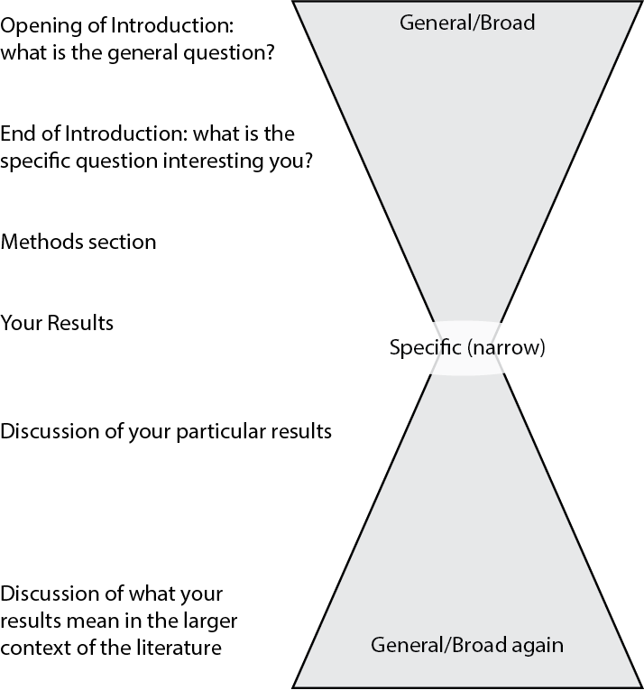

# Code Bits for Guide


## PLACEHOLDER PAGE

We are looking for an author for this page, or someone who can contribute existing materials they have written. The text will be published under a Creative Commons 4.0 BY/NC/SA license, and copyright will remain with the original author.


## Additional Tools

[Intro to Markdown](https://shiny.rstudio.com/articles/rmarkdown.html)

[Changing the theme](https://r-coder.com/rstudio-themes/#Create_your_own_RStudio_themes_style)

[Link to Guide](https://adanieljohnson.github.io/SWP_student_writing_guide/)

[Link to workshop](https://github.com/adanieljohnson/ABLE_2022_Workshop)


## Subprojects Within SWP

1. Biology Lab Writing Guide
2. Structured Training Activities
3. Diagnostic Activities
4. Automated Supports for Students and Instructors
5. Bins-Based Scoring
6. Coaching Oriented Feedback
7. Logistical Support Tools
8. Ongoing Research


#Instructor Guide

## How to Modify Our Resource Guide

Unlike a print book, we __assume__ other instructors will modify this Resource Guide to fit their local needs, and address the problems they see most often with their own students. Given that, we do have some general recommendations for the Guide as a whole. 

1. Focus on the __largest, most serious writing skills gaps your students have first.__ Look systematically at the products of your students locally, and try to quantify how many students make particular mistakes, not just which mistakes your team finds are the most irritating. Rank the mistakes so you are confident that you have identified the 5-10 most serious shortcomings in their scientific writing. These are your priority goals. They are what you need to focus on first, and what you need to keep foremost in your mind as you revise this Guide. 

2. Look at the topics listed in the Preface and Table of Contents. If you have resources you are using to teach these elements of scientific writing successfully, you can simply move our overlapping units or pages to an archive folder, and use your local resources. When Bookdown renders the book, chapters will be renumbered automatically. Documents in the archive folder will still be available in the future, or you can download new copies from our repository.

2. The Preface is written assuming students are the main audience. If a particular section goes too deeply into the reasons behind our approach, delete those sections before compiling the book or individual documents. 

3. __Part 3__ is the main deep dive into scientific articles and lab reports for biology. We show students what goes in each section, point out where our own students struggle with each section, and suggest ways to avoid common pitfalls. We strongly urge instructors to incorporate their own observations and suggestions so that the Resource Guide addresses the specific local needs.


## Editing the Guide Itself

### Organization

Each chapter is a plain text file with an .Rmd file. This is the standard format for R Markdown files. If you change the extension of the file name from .Rmd to .md, the file will switch to a plain Markdown file, and vice versa. Both file types are just plain text (.txt) files. The extensions simply tell your computer which programs to use to open and edit the files. In practice, you can write new chapters entirely as plain text files using a free text editor. When you are ready to implement them, simply change the extension on the filename.

Each .Rmd file begins with a 3-digit number, which tells programs the order in which to add the files to the book. To change the order of the chapters, just change the order of the numbering. There are other ways to tell R Studio how to arrange pages, but this way is obvious and fairly painless. 

Chapter files begin with the chapter title as a level-one header, e.g., `# Chapter Title`. Each chapter is divided into sections using lower-level headers, e.g., `## A Section Within a Chapter`. 


### How to Create Cross-Links Between Pages

An in-book crosslink is formatted this way:
```
[link text](#for-instructors)
```

The first part in square brackets is the highlighted text that will be displayed. The hashed text in parentheses is the label from the page or section that is the target. 

Chapters and Sections are given labels automatically when the document is rendered. These automatic labels can be replaced by adding an explicit {#label} after them. This overrides the automatic labels. Adding an explicit {#label} routinely to the end of the chapter headers is a good practice if you know you’re going to refer to something, or will refer to it repeatedly. We have already included explicit {#labels} for the existing chapters. You may wish to revise them or add others. 

If you want to refer to a chapter or section number, you need to use the `\@ref(label)` instead. For example:
```
In chapter \@ref(install-git) we explain how to install Git.
```
renders this way:
```
In Chapter 6 we explain how to install Git.
```

Pandoc's documentation provides more details on automatic section IDs and header cross-references.


#### Explicit Cross-references

Explicit cross-reference tags have already been attached to the highest level header in most of the current pages (only pages in the Preface were excluded.) These explicit tags can be used to create the cross-references between pages, using the format:

[desired crosslink text](#explicit-reference) = "__desired crosslink text__"

(#goals100)
(#reading120)
(#readstrats125)
(#hypothesis200)
(#expdesign210)
(#variables215)
(#replicates220)
(#articleparts300)
(#titles320)
(#introduction340)
(#methods350)
(#results360)
(#discussion380)
(#datatypes400)
(#chartsone425)
(#chartstwo426)
(#photos430)
(#tables435)
(#biostats450)
(#sumstats460)
(#compstatsone470)
(#compstatstwo473)
(#compstatsthree475)
(#models480)
(#sources500)
(#sourcearguments505)
(#paraphrasingone506)
(#paraphrasingtwo507)
(#paraphrasingthree508)
(#citformats510)
(#citmistakes515)
(#zotero520)
(#toolbox600)
(#strategies610)
(#toulmin615)
(#mechanicalflaws620)
(#peerreview630)
(#submissioncheck650)
(#teachertools700)
(#binsscore705)
(#commenting710)
(#tatraining720)
(#bibliography750)
(#appendix800)
(#appa810)
(#appb820)
(#appc830)


#### Advanced Info: How Cross-References Work

[Learn more about cross-links here.](https://happygitwithr.com/bookdown-cheat-sheet.html)

For routine writing and editing, it is a good idea to pick 1-2 ways of creating cross-references and stick with them. If you want to explore other options besides the ones described above, there are three ways to create cross-links between documents:

1. Using an __explicit__ identifier: in `# My Chapter {#foo}` the explicit identifier is "foo". The hash is part of the identifying markup.
2. Using the __automatically__ generated identifier: the text of the headers, with spaces replaced with dashes, is the identifier. For a chapter with the title `# My Chapter`, "#my-chapter" will be the automatically generated identifier. Pandoc creates these auto-identifiers according to rules laid out in `Extension: auto_identifiers.` 
3. The header text itself can be used verbatim as an __implicit__ header reference. See Extension: implicit_header_references for more.


All 3 identifiers can be used to make cross-references but the link structures are different. The advantages of sticking to explicit identification are:

* You are less likely to update the section header and then forget to make matching edits to references elsewhere in the book.
* You can name them in a way you can remember more easily
* It makes it easier to keep a running list of all the explicit IDs, so you can refer back to them later.


### Other Markdown Tips and Tricks

#### Adding Page Breaks 

These are recognized by LaTeX, HTML (when printed), Word, and ODT.

```
The first section

\newpage

The second section
```


#### Keeping Text Indentation

Extra spacing gets removed when R Markdown files are rendered. To preserve indentation, start the line with a vertical bar (|). The line breaks and any leading spaces will be preserved in the output. For example:
```
| When dollars appear it's a sign
|   that your code does not quite align  
```


#### Adding and Adjusting Images

If a plot or an image is not generated from an R code chunk, you can include it using the Markdown syntax of `.` This works for local image files and for images on the web. The size of the image can be controlled as well. For example:

{width=50%}

To center an image and legend, use this. DO NOT remove the extra spaces:

<center>

{width=50%}

</center>


## Workflow Strategies

### Focused on an Independent Text Editor

1. Write documents in plain Markdown text.
2. Save with ".md" extension.
3. EITHER:
    + Process directly using Pandoc AND/OR 
    + Add to an RStudio project for further work.


### Focused on R Studio

1. Write documents in R Markdown text.
    + R Studio can handle .md files just fine.
2. Save with ".Rmd" extension.
2. EITHER:
    + Process using Knitr/Bookdown to generate .md files in a single "docs" folder.
    + Use Knitr to process files into .docx, .html, or .pdf format.


### .md versus .Rmd

A basic .md file and .Rmd can have identical content, and only their extension is different. Both behave basically the same in a plain text editor, although you may have to set your text editor to recognize .Rmd files. The difference is that, when you put R code and YAML handling information into a plain .md file, it is treated as plain text. When you put the same R & YAML code in a .Rmd file, and the file is run or knitted in R/RStudio, those code blocks are executed. 


## Resources

### Why Use This Ecosystem?

[Read original Overview](https://happygitwithr.com/big-picture.html)
[Read the full book: Happy Git and GitHub for the useR](https://happygitwithr.com/index.html)

This book, and the first chapter in particular, explains why data scientists (and now biology instructors) have adopted collaboration tools designed originally for software developers. Don't panic: it is very easy to understand.

From the author:
> Happy Git provides opinionated instructions on how to:
> * Install Git and get it working smoothly with GitHub, in the shell and in the RStudio IDE.
> * Develop a few key workflows that cover your most common tasks.
> * Integrate Git and GitHub into your daily work with R and R Markdown.

> The target reader is someone who uses R for data analysis or who works on R packages, although some of the content may be useful to those working in adjacent areas.

> The first two parts, 'Installation' and 'Connect Git, GitHub, RStudio', provide a "batteries included" quick start to verify your setup.


### Where To Learn More About R Markdown

[Getting Started in R Markdown](https://www.r-bloggers.com/2020/02/getting-started-in-r-markdown/)
Great overview of how R Markdown documents are structured and what the pieces do.

__[The Definitive Guide to R Markdown](https://bookdown.org/yihui/rmarkdown/)__
Dense but thorough. Emphasis is on completely documenting what R Markdown can do.

__[R Markdown Cookbook](https://bookdown.org/yihui/rmarkdown-cookbook/)__
Focuses more on how to solve the most common problems.

