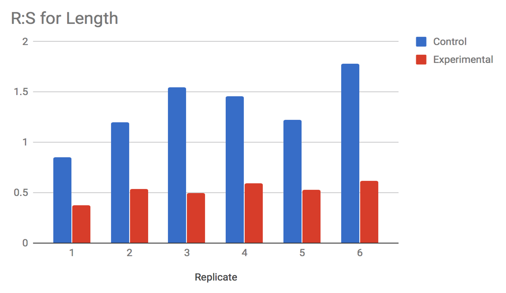
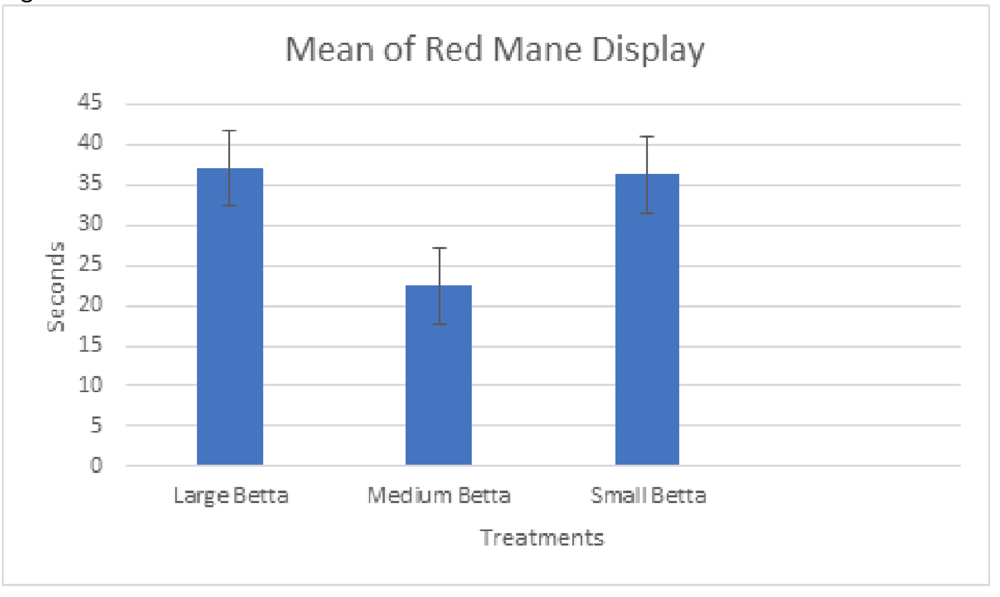
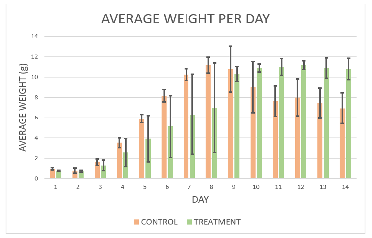

# Summarizing Data: Figure Legends {#chartstwo426}

## Writing Figure Legends

The figure legend for each graph should include a Figure #. The figures should be numbered in the order they are first referred to in the text. The first sentence should explain what the graph is showing generally. The legend also should describe any summary statistics that are included in the graph. 

Beyond these guidelines, figure legends vary in how much information they contain. Generally though, the figures combined with their legends should summarize most or all of the experiment. Readers should not have to look back at the text to understand the figures.  

## Tips For Creating More Effective Graphs

These tips address the most frequent mistakes we see in our students' graphs. 

* Be sure your graphs are legible. Do not try to put too much data in a single figure. Clutter keeps readers from extracting information effectively. 
* Use fonts and font sizes that are easy to read. 
* Do not skimp on space. Small figures are hard to read. A rule of thumb is to draw graphs so they fill at least half of a standard print page. 
* Use clearly different textures or plot elements to indicate different sets of data (for example, black vs. white bars in a bar graph, or different shaped symbols like in Example 2 below.
* When you plot means in a bar or line graph, always include error bars that show the standard error of the means. 
    + Don't let Excel decide what the error bar values should be; its default choice is not correct for scientific articles. Put in the standard error bar values yourself.
    + Usually you will use +/- 1 s.d. for your error bars.
    + Be sure to say in the figure legend what the error bars represent.  
* Be sure to label the x-axis (independent values) and y-axis (dependent values) properly. 
* Don't put a title above the graph. Your figure legend does that job.
* Check, recheck, and check again that the figures are numbered in the same order that you refer to them in your report. 

## Examples of Poorly Designed Graphs & Legends

### Example 1

{width=80%}
 

__What Could Be Improved?__

1. This figure shows raw data, not summary data, which is a definite no-no.
2. There is no figure legend, so we do not know what the experimental group is.

 

### Example 2

{width=80%}
 

__What Could Be Improved?__

1. Like Example 1, this figure has no legend, so we are not sure how to interpret it. 
2. Normally, a figure will not have a title. This is part of the information that should be in the legend. 
3. We do not know how many animals or replicate trials each bar represents.

 

### Example 3

{width=80%}
 

__What Could Be Improved?__

This figure is better than the first two, but still could be more informative. 

1. What does the author mean when they say "group by standard deviation."?
2. How many organisms are we looking at for each group?
3. This is more a judgement than a hard rule, but it is hard to see trends in the data when there are so many bars. These data probably would have been better represented by a line graph.

 

## Examples of Well-Designed Graphs & Legends

### Example 1

{width=80%}

 

__What Is Particularly Good?__

1. We know exactly what test subjects we are looking at, and what the scales are for the data.
2. The legend fully explains what the graph shows, including number of organisms tested.
3. The data are not crowded to the point of becoming hard to interpret.

 

### Example 2

{width=80%}
 

__What Is Particularly Good?__

1. The two potentially confusing variables (light level, change in DCIP absorbance) are clearly defined.
2. The author used obviously different colors for each of their lines, making them easier to tell apart.
3. The data are not crowded; we clearly see the differences between different light levels over time.

 

### Example 3

![Figure 3. Change in light absorbance with time of a catalase enzyme solution. Darkening of a solution of 0.1 units/mL of catalase in PBS in artificial sunlight was measured by absorption at 634 nm. Time indicates how long (in seconds) the same was exposed to a panel of high-intensity broad-spectrum lights (details are in the Methods.) Each point represents an independent sample. Overall, the catalase solution darkened very quickly when exposed bright broad spectrum light approximating full sunlight.](images/Scatter_data1.png){width=80%}

 

__What Is Particularly Good?__

1. The two axes are clearly labeled in the image, and clearly explained in the legend. 
2. The legend explains what each data point represents.
3. There is a statement summarizing the main observation of this graph.

 

## Learning How to Create Graphs

__HHMI Interactive__ has five free tutorials on using spreadsheets to graph and analyze data.

* Spreadsheets Tutorial 1: [Formulas, Functions, Averages](https://www.biointeractive.org/classroom-resources/spreadsheet-tutorial-1-formulae-functions-and-averages)
* Spreadsheets Tutorial 2: [Autofill Data, Cell References, and Standard Deviation](https://www.biointeractive.org/classroom-resources/spreadsheet-tutorial-2-autofill-data-cell-references-and-standard-deviation)
* Spreadsheets Tutorial 3: [Column Graphs, Error Bars, and Standard Error of the Mean](https://www.biointeractive.org/classroom-resources/spreadsheet-tutorial-3-column-graphs-error-bars-and-standard-error-mean)
* Spreadsheets Tutorial 4: [t-Tests](https://www.biointeractive.org/classroom-resources/spreadsheet-tutorial-4-ttest)
* Spreadsheets Tutorial 5: [Histograms](https://www.biointeractive.org/classroom-resources/spreadsheet-tutorial-5-histogram)

 

There are many other good web and video tutorials available. These open-access tutorials can help you start learning how to graph data. Your instructor may have others they prefer, or your school may have a subscription to an on-demand training service like __Linked-In Learning__.

Web: [Step-by-Step Graphs](https://www.excel-easy.com/data-analysis/charts.html)
Well-illustrated web-based tutorial that you can do at your own pace.

Web: [Introduction to Graphs and Charts](https://www.goskills.com/Excel/Resources/Excel-chart-tutorial)
This is a teaser for a more in-depth tutorial from a commercial training company. Still the basics they show will get you most of the skills you need.

Video: [Line and Scatter Graphs](https://www.youtube.com/watch?v=0jdX22qM8JA)
While focused on one type of graph, this video provides a good overview of all the customization options.

Video: [Deeper Dive Into Graphs](https://www.youtube.com/watch?v=hVRVe-JUZd0)
This is a much longer video tutorial but covers more, including how to lay out your data for graphing, and more options for customizing graphs.

