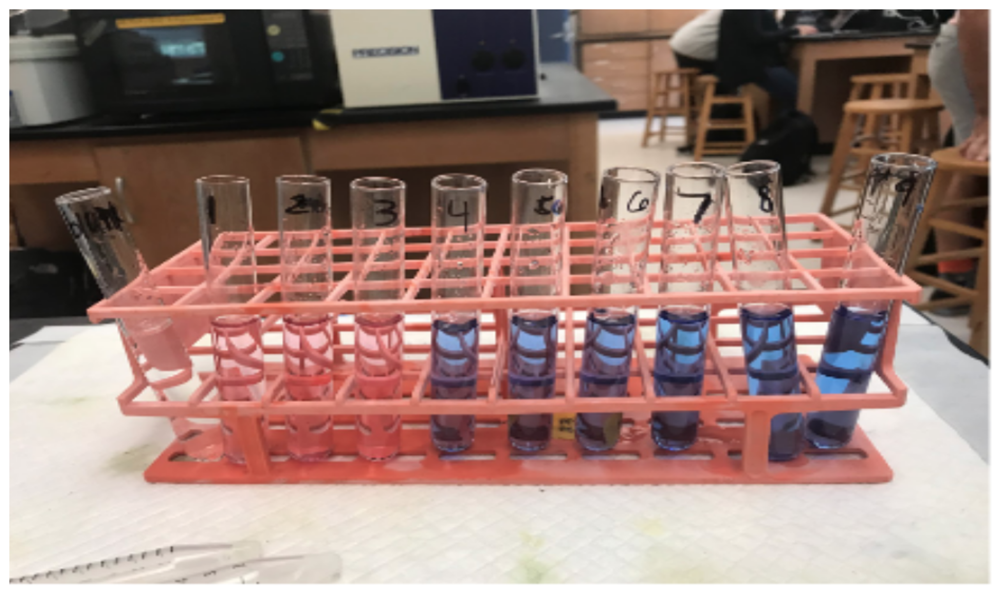
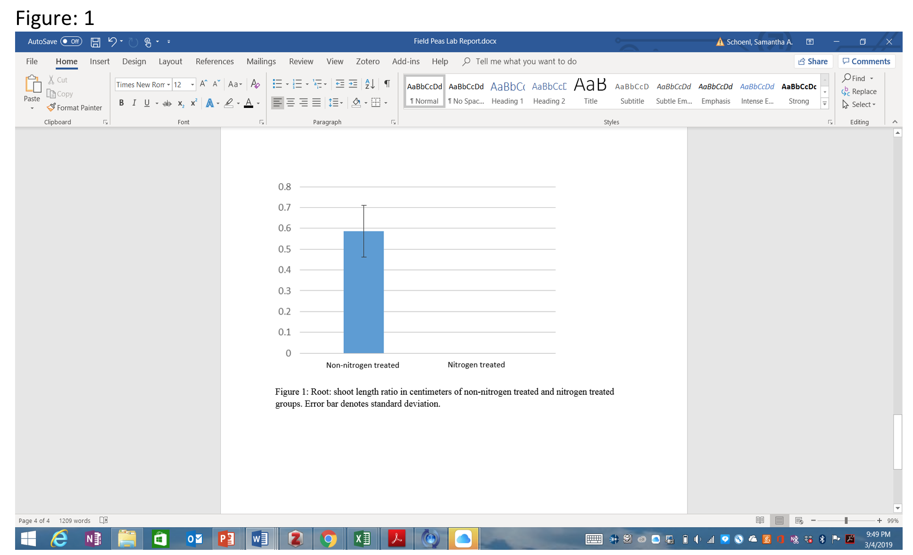
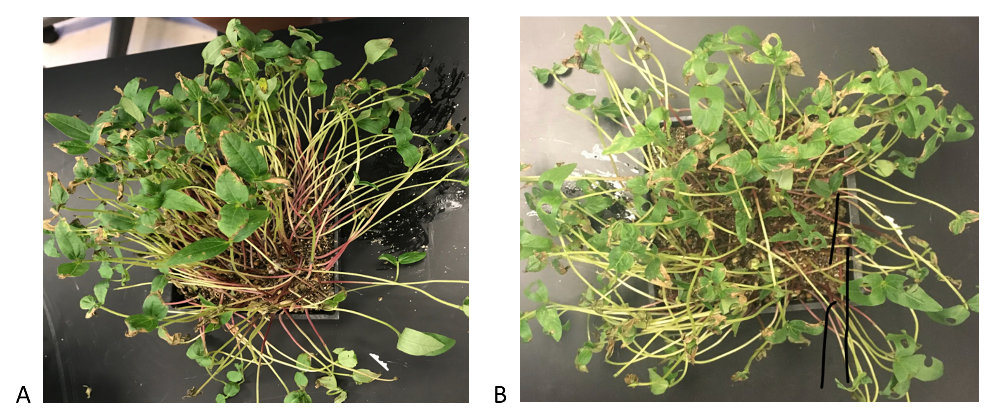
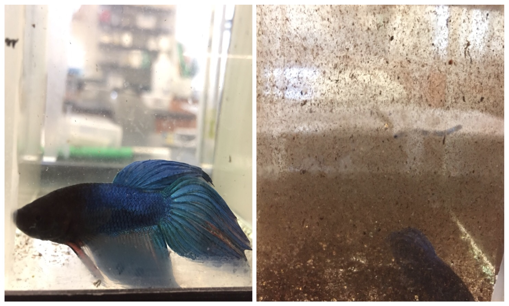
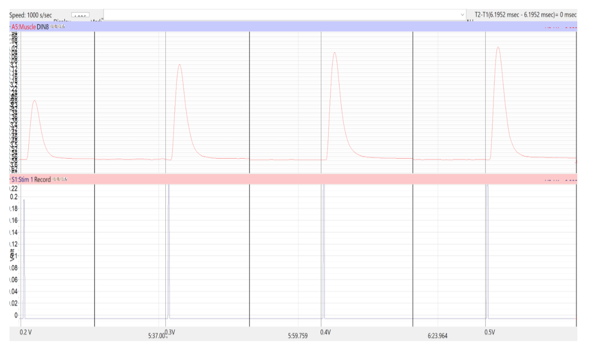

# Photos,  Diagrams, and Illustrations {#photos430}

Photos and diagrams (drawings, maps, or other visual data) summarize data that are not described easily in words or cannot be presented in a graph. A map of the 2–dimensional distribution of organisms in a test site, or photos of the pattern of blue staining in control and cold–treated transgenic plants, are two examples. An illustration summarizing the workflow of the experiment would be another example. 

Like all figures, photos and diagrams should have a figure number and caption describing what is shown.

When using photos and diagrams, do not include every photo or diagram you have. Select just a few that will show the reader of the outcome of your experiment. Crop photos so the important visual information fills the frame. Photos and diagrams should have a figure number and caption describing what is shown. 

Look at these examples. Which are more informative, and visually better organized?

## Examples of Poor Photos and Diagrams

### Example 1

{width=80%}

 

__What Could Be Improved?__

1. The photos are presented out of order. Figure 4 shows the last day of the experiment, and Figure 5 shows the first day.
2. The photos have titles with footnotes; all of this text should only be in the legend.
3. The caterpillars are photographed on Day 1 with the lids on. The reflection obscures them from view.
4. There is no interpretation or explanation of what we are seeing on the final day.

 

### Example 2

{width=80%}

 

__What Could Be Improved?__

1. This photograph probably is not needed. The color difference could have just have been stated in the text. 
2. The photo is not cropped to remove the extraneous background.
3. The legend is not very informative. It says "...along with the same constants the rest of the tubes had. This photo shows why the procedure deviation was necessary." What constants? How does this photo show why the procedure had to be changed? 

 

### Example 3

{width=80%}

 

__What Could Be Improved?__

1. The background is very cluttered with items that do not have anything to do with the study.
2. Which plants were grown in shade, and which ones in light? The legend does not say, so we have to guess.
3. What should we notice or pay attention to?

 

### Example 4

{width=80%}

 

__What Could Be Improved?__

1. This bar graph was inserted as an uncropped screen shot. It needs to be cropped down so only the graph is showing. Better yet, save the graph as a separate image file.
2. Remove the figure legend from the photo.
3. In the legend, how many observations ("n") do the mean and s.d. represent?

 

## Examples of Well-Chosen Photos and Diagrams

### Example 1

{width=80%}

 

__What is Particularly Good?__

1. The images are cropped so only the important details are showing. 
2. The photos are taken far enough from the containers to see the range of control and treatments plants.

 

### Example 2

{width=80%}

 

__What is Particularly Good?__

1. The image is cropped so that the two most important features (colors of the fish, and clarity of the room beyond) are highlighted, and all extraneous parts of the image have been removed.
2. The legend makes it clear what the reader should take away.

 

### Example 3

{width=80%}

 

This diagram is an unusual case. At first it looks like the author has included raw data, but the figure legend explains that they are trying to illustrate one of their observations from the experiment. In this instance, including one example of raw data from their dataset was appropriate. 
