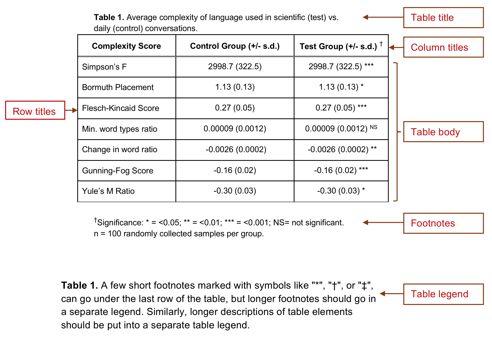
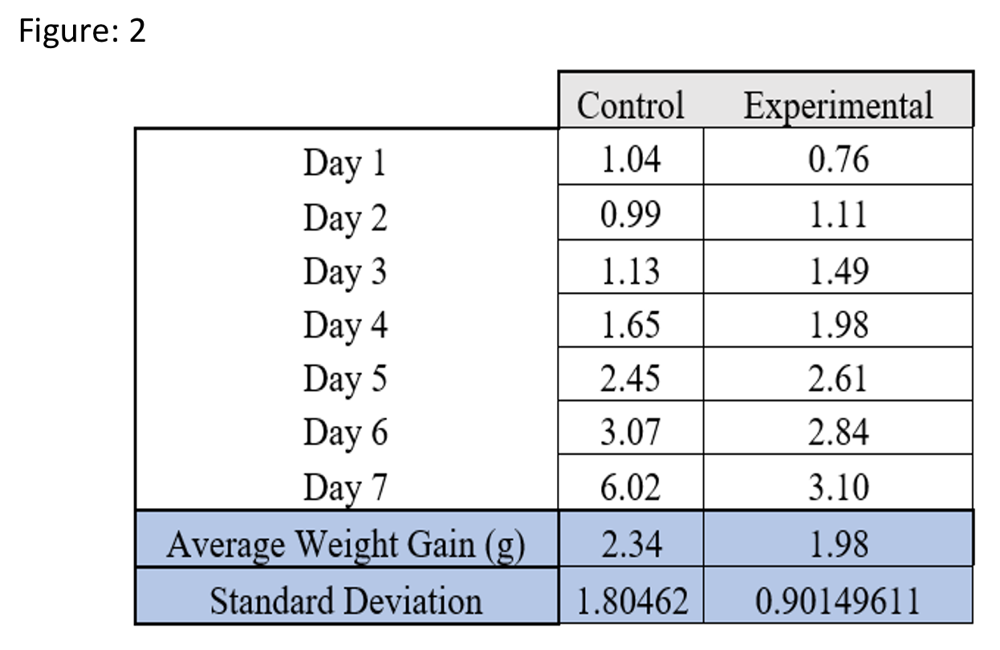
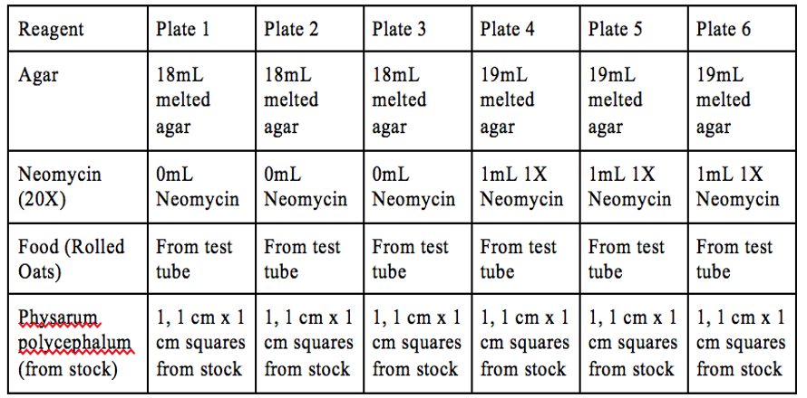
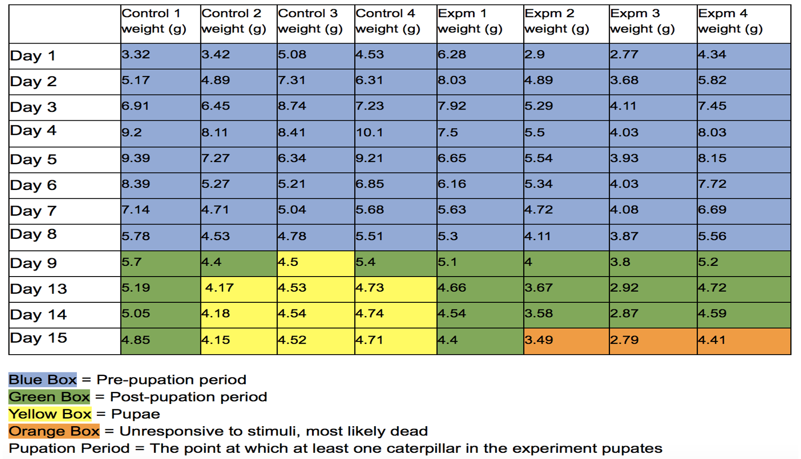

# DRAFT Summarizing Data: Data Tables {#tables435} 

Students sometimes get confused when we say tables, and it is partly our fault, because there are TWO kinds. __Data collection tables__ are what you use to collect and organize raw data as you conduct an experiment. Your data collection tables are drawn in a paper-based lab notebook, entered in an electronic lab notebook, or created using MS Excel or Word. These tables contain unedited information that is meant for your use. You may be asked to turn in data collection tables as part of a class assignment. However a lab report should never contain raw unanalyzed data. 

__Summary data tables__ bring together the raw data points, summarize them in some way, and present the summary values or information so that another reader can make sense of the data quickly. All of the data tables in a lab report should present summarized data. 

Each table should have a Table # and __SHORT__ descriptive title placed above the table itself. Tables should be numbered in the order they are referred to in your text. 

The rows and columns must be neatly arranged, and the data should be easy to read (not crowded). Clearly label the columns and rows of your table. Keep the column titles short. If longer titles cannot be avoided, use 1-2 word column titles in the table, then explain the column titles further in a separate table legend. 

A few short footnotes, either numbered with a superscript or marked with symbols like "*", "†", or "‡", can go under the last row of the table, but longer footnotes should go in a separate table legend. 

The table legend is like a figure legend in it explains details of the table that had to be left out to maximize legibility. Table legends go on a separate page, just like figure legends.

{width=80%}

 

Beyond these basic guidelines, there are innumerable ways to organize data summary tables. As you read scientific articles, pay attention to how they lay out their tables. Which ones make it easier to understand their argument or review their evidence? Those are the tables you should use as models. Which tables are hard to understand? Why? Those are examples of what you should NOT do.

## Inserting Tables and Figures in Your Reports

Like figures, tables are numbered separately, in the order they are referred to in your text. You MUST reference each table in the text of your lab report. If you do not reference each table, readers do not know where to look for the data you are using to support your claims. 

Table legends then tables are placed in that order at the end of a lab report, after the Literature Cited, starting on a new page.

## Creating More Effective Tables

These tips address the most frequent mistakes we see in our students' summary tables. 

* DO NOT include a table with all of your raw data observations.
* Be sure your tables are legible. Do not try to put too much data in a single table. Crowded tables are hard to interpret.
* The numbers are the most important part of the table. Make sure they are the most prominent element of the table. 
* Use the minimum amount of text you can. 

## Examples of Poorly Made Data Tables

### Example 1

__What Could Be Improved?__

1. This table presents the raw observations the author made. Averaging the weights over the 7 days does not change the fact this is raw data.
2. The table is misleading. It does not describe the caterpillars' weight __gain__, just the average weight. 
3. The legend does not say what the experimental group has been treated with.
4. The legend calls this a figure, when it is a table.

 

### Example 2

__What Could Be Improved?__

We see tables like this one fairly often. The author is using a table to explain their methods. This is not bad on its own, but look at how much information is repeated. The table could easily be reduced to 3 columns: Reagents, Plates 1-3, and Plates 4-6. Or, the table could be eliminated entirely and this description included in the text of the Methods section.

 

### Example 3

__What Could Be Improved?__

At first this looks like a very informative table. However it has several things that need to be corrected.

1. The table contains raw, unsummarized data.
2. The dark fill colors make it hard to read the values in the table.
3. It is a table, not a figure.
4. Why is "Pupation Period" defined in the legend? Where is that used?

 

## Examples of Well-Made Data Tables

### Example 1

__What is Particularly Good?__

 

### Example 2

__What is Particularly Good?__

 

### Example 3

__What is Particularly Good?__

 

