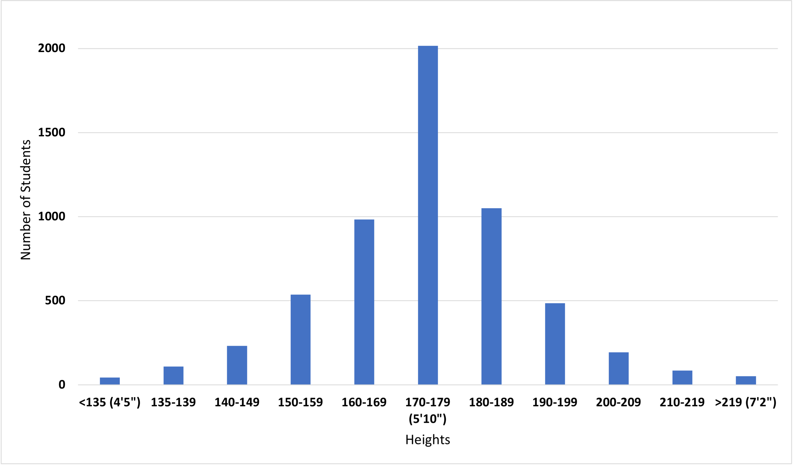
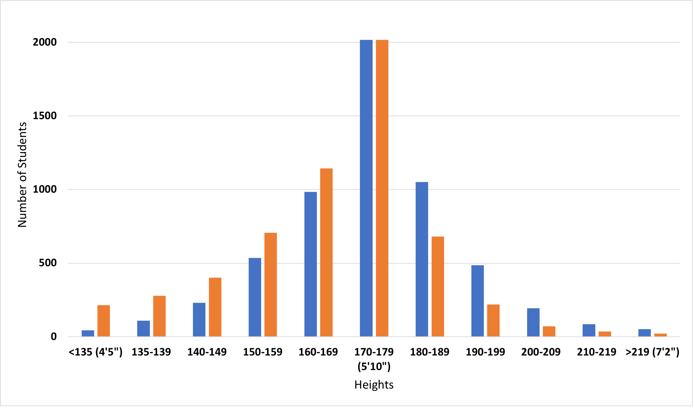

---
output:
  word_document: default
  html_document: default
---
# Biostatistics 1: Summary Statistics {#sumstats460}

Summary statistics make it much easier for your readers to understand and think about your data. The questions you want to answer for your readers are:

* What is the midpoint of your observed data?
* How wide is the range of your observed data? 
* Are your observed data points similar to each other, or spread far apart?

Mean and median values provide them with estimates of the midpoints of each of your experimental groups.  Standard deviation, standard error, variance, etc. (what we call __measures of dispersion__) provide readers with an estimate of the range or spread of your data, and how the measurements are distributed. 

For these statistics to make sense we need to explain what we mean by distributions.

## Normal Distribution 

Statistics is built around assumptions about how data are distributed. Imagine we measured the height of every student on campus. We get the following data set.

__Table 1.__ Distribution of student height on campus.

|Height (cm)|# students|
|:-:|:-:|
|<135 (4'5")|44|
|135-139|109|
|140-149|231|
|150-159|536|
|160-169|984|
|170-179 (5'10")|2016|
|180-189|1051|
|190-199|486|
|200-209|194|
|210-219|85|
|>219 (7'2")|52|
|Total|5788|

 

If we plot these data as a series of bars showing the counts for each category, we get a __histogram__ like the one in Figure 1.

{width=80%}

 

The histogram shows us the __distribution__ of the numbers that represent our observations. The histogram shows there are about the same number of students on either side of the peak (there are 1904 students who are less than 170 cm tall, and 1868 students who are greater than 179 cm tall.) Data are said to have a __normal distribution__ when there are about the same number of data points above and below the midpoint.

Suppose we observed instead that there are 2744 students who are less than 170 cm tall, and 1028 students who are greater than 179 cm tall. The midpoint of the data still is 170-179 cm, but now the data are not normally distributed. We call this a __skewed distribution__. 

{width=80%}

 

When writing up your own experiments in lab reports, you will be working with smaller datasets, and skewed distributions will not be a big concern. When you begin working with larger datasets, there are statistical methods for quantifying the relative amount of skew in the data distributions. 

## Arithmetic Mean

There are many ways to describe the midpoint of your summarized data but most of the time you will be describing your data using an arithmetic mean. 

The __arithmetic mean (x̅)__, or simply the __mean__ is the sum of all the observations divided by the number of observations. It is the most common statistic that describes data that is symmetrically distributed in a frequency graph. When someone says “the mean” or “the average,” this is what they are talking about.

For example, the counts in each of the bins in Table 1 add up to 5788. The arithmetic mean is:

> x̅ = 5788 (sum of all observations)/11 (# bins)  = 526.2 students/bin

Arithmetic mean is very useful, but also sensitive to extreme values, which means it does not work well for data that are highly skewed. Imagine that you are measuring the heights of trees in two areas of equal size. 

{width=80%}

 

Plot A is in a mature, undisturbed forest. Plot B experienced a fire a few years ago that killed all but 2 very large trees. Since then, new seedlings have sprouted. There are dozens of small trees now, all about the same height.

If we calculate the arithmetic mean of the tree heights in the two plots, we might calculate that the mean tree height is similar for the two plots even if our eyes tell us that is not right. So the arithmetic mean alone does not provide enough information to compare the plots. We need to report a second value that describes the dispersion of the data points.

### Advanced Topic: Other Ways to Calculate Means

You will not use them in most biology classes, but there are many other ways to estimate the mean for a set of measurements. The __geometric mean__ is often used to describe the mid-point of numbers that grow exponentially. For example, human population growth rate has grown exponentially over time. If we wanted to express the mean value, we would use the geometric mean. The other mean used in science regularly is the __harmonic mean__, which is used to describe the mid-point for ratios or rates like speed.

These and other ways to calculate means are useful in particular situations. When you are first starting out in biostatistics, it is safer to stick with a simple arithmetic mean. As specific situations arise, your instructor may introduce other ways to calculate means.

## Advanced Topic: Median

Where the mean is a mathematical descriptor of your data, the __median__ estimates the middle of the distribution is the actually __observed__ middle of a range of observed values. We determine median by sorting the values in rank order (lowest to highest). The median is the middle measurement in the set. 

For example, these are the counts in each of the bins in Table 1, sorting in order: 44, 52, 85, 109, 194, 231, 486, 536, 984, 1051, 2016. The middle value is the 6th out of the 11 values, or 231. When there are an even number of values, the median is the arithmetic mean of the middle two values.

Median would be included in a report like this:

> Median = 231, n = 11.

Median is not very useful when you are working with small datasets. It is more informative when you have dozens to hundreds of data points. We point it out here mainly so you do not confuse it with mean.

## Standard Deviation

For routine lab work you mostly will use standard deviation to describe the dispersion of your data points.

__Standard deviation (SD)__ is a measure of the spread of data points in a distribution around the mean, using the same units as the data points in that distribution. It measures how far from the mean observations typically are. When the standard deviation is large compared to the mean, that tells us most observations are far from the mean. Conversely, if the standard deviation is small, most measurements lie close to the mean.

Standard deviation has a predictable relationship to the normal distribution. When data are normally distributed:

* 68% of data points within a dataset will have values within ±1 standard deviation of the mean
* 95% of data points within a dataset will have values within ±2 standard deviations of the mean
* 99.7% of data points within a dataset will have values within ±3 standard deviations of the mean. 

Standard deviation is directly correlated to the number of measurements. The more measurements you use to calculate standard deviation, the smaller the value will be. So when we report standard deviation, we always report the number of observations (n) used to calculate it.

## Calculating Summary Statistics in Excel

You can use MS Excel to calculate mean and standard deviations for numerical measurements. 

* Use the formula "=AVERAGE(data:range)" to calculate the arithmetic mean for all values in the cells listed in "data:range".
* Use "=STDEV(data:range)" to calculate the standard deviation.

## Reporting Mean, Standard Deviation, and # Observations

In the text of a report, you should always report summary statistics as mean, standard deviation, and number of measurements (x-bar, s or s.d., and n). For example, we could summarize Table 1 like this:

> The number of students in each of the height measurement bins ranged from 44 students in the smallest bin to 2016 in the largest bin (x̅ = 526.1 students/bin, s.d.= 61.1, n=11 bins).

When you are graphing summarized data, you should include error bars representing one standard deviation on the graph itself. The figure legend should state clearly that the error bars represent 1 s.d., and you should include and explain the value for n. 

