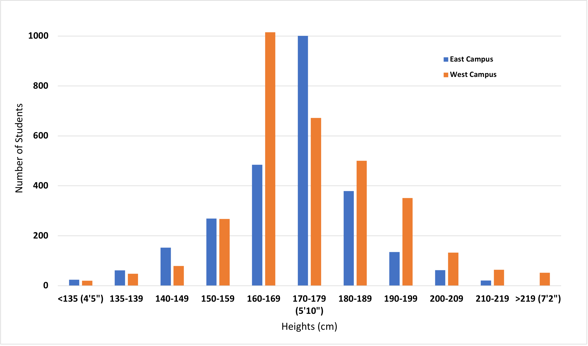
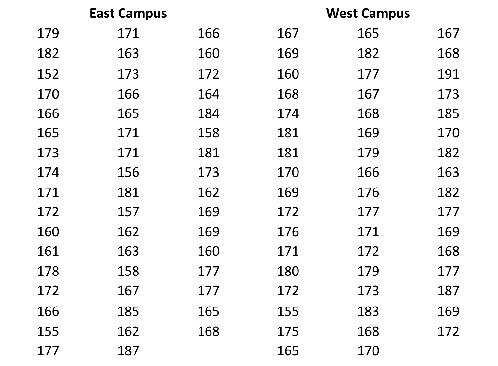
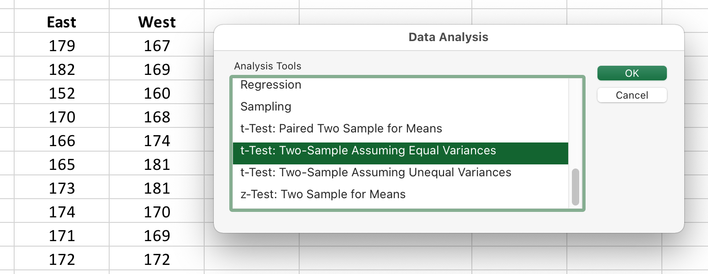
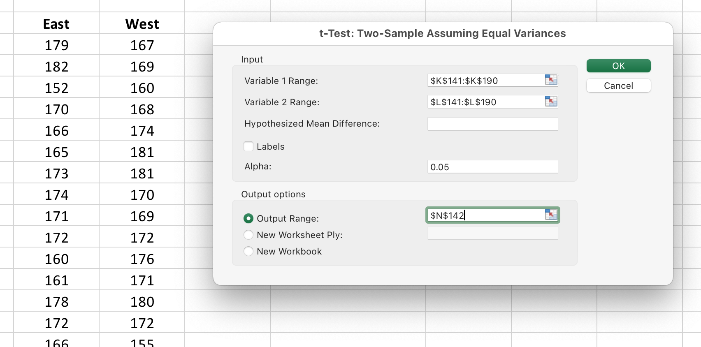
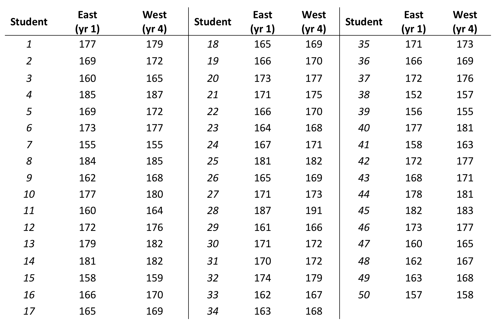

# Biostatistics 2: Comparing Groups - T-Tests {#compstatsone470}

T-tests are a family of statistical tests that compare two groups of data points to determine whether the means of the measurement variable are the same. All of the tests in the t-test family use the t-distribution to estimate probabilities. The main differences between the various t-tests is what and how the groups are compared.  

The most common version is the __two-sample t-test.__ It tests a null hypothesis that the means of a measurement variable are the same in two independently sampled groups.

The other widely used version is a __paired t-test.__ It tests a null hypothesis that the means of the measurement variable are the same before vs. after a treatment. This test takes into account the pre-existing variation in the measured variable.

This video is a good introduction to [T-tests](https://youtu.be/AGh66ZPpOSQ)


## Two Sample T-Tests

Two-sample t-tests compare the means from two groups of data. Usually the comparison is between the mean of a control group and the mean of an experimental group. Sometimes though, the comparison is between two experimental groups.

You can use the two-sample t–test when you have one categorical variable and one measurement variable, and you want to compare the mean values of the measurement variable. The categorical variable must have only two values, such as "present" and "absent" or "treated" and "untreated." 

Two-sample t-tests should only be used when you are comparing data collected from two __independent groups__. This mean that the data were collected from completely different groups of organisms, different locations, etc. If the groups are connected (paired) you need to use a paired t-test, which is explained in the next section.

There are two versions of the two-sample t-test:

* You should use __Student’s t-test__ when the data points in BOTH groups are randomly distributed, not skewed.
* You should use __Welch's t-test__ (also called Welch's unequal variances test) when the measured variables are not equally distributed, or the two groups have different sample sizes. 

A rule of thumb is that you should use Welch's t-test if either the standard deviations of the two groups you want to compare are more than 10% different from one another, or the number of observations are more than 10% different between the two groups. 

In practice, the number of data points you usually work with in a biology lab course is small enough that the choice of test is not critical. So if you do not have access to a program that can run Welch's t-test, use Student's t-test.

> Advanced: There is a long-running debate over which test to use. Some statistics specialists say you should ALWAYS use Welch's t-test, but others say you will overlook small but significant differences. Google "Welch's vs. Student's t-test" if you want to see the arguments on both sides.


### An Example of a Two-Sample T-test

Let's go back to an earlier exploration of the distribution of student height on campus. Now we want to know if there is any difference in average height of students living on the eastern half versus the western half of campus.

__Table 1.__ Distribution of student height on campus.

|Height (cm)|# students, east half|# students, west half|Total|
|:-:|:-:|:-:|:-:|
|<135 (4'5")|24|20|44|
|135-139|61|48|109|
|140-149|152|79|231|
|150-159|269|267|536|
|160-169|484|1015|1499|
|170-179 (5'10")|1001|672|1673|
|180-189|379|500|879|
|190-199|135|351|486|
|200-209|62|132|194|
|210-219|21|64|85|
|>219 (7'2")|0|52|52|
|Total|2588|3200|5788|

<br/>

If we plot these data as a series of bars showing the counts for each category, we see the distribution shown in Figure 1.

<center>

{width=80%}

</center>
<br/>

It looks like there is a difference in the height of students on west vs. east campus, but can we be sure? 


#### What Do the Statistical Hypotheses Look Like For a Two-Sample T-test?

The statistical __null hypothesis (H<sub>0</sub>)__ is that the means of the measurement variable are equal for the two categories.

> H<sub>0</sub>:   x̅ (Group 1) = x̅ (Group 2)

In terms of our original question, the null hypothesis is that there is no difference in the height distribution of students living on east (Group 1) vs. west (Group 2) campus. The differences in bin distributions are due to random chance.

There are two different ways you can describe the __alternative hypothesis (H<sub>A</sub>)__. Which way you choose depends on what you know already, or what your predictions are.

If you have some prior information or other observations, you can make a prediction that the two groups will be different from one another in a particular direction. In other words, you can predict in advance which group will have a mean that is significantly greater or less than that of the other group. Depending on the direction you choose, your alternate hypothesis would be:

> H<sub>A</sub>:  x̅ Group 1 > x̅ Group 2

> or

> H<sub>A</sub>:  x̅ Group 1 < x̅ Group 2

Say you noticed that a lot of taller students live on west campus. So we can choose a hypothesis that includes a specific direction, and predict that the mean height of students living on east (Group 1) campus is less than the mean height of students on west (Group 2) campus. In other words, your alternate hypothesis is H<sub>A</sub>:  x̅ Group 1 < x̅ Group 2. 
Because we have made a prediction of change in one direction in our hypothesis, we will be running a __one-tailed t-test.__ 

Now suppose we did not have the histogram in Figure 1. We suspect there is a height difference but we do not have any prior data from which to predict which group will be taller on average. We only can predict that the two groups are different. Now the alternate hypothesis will be:

> H<sub>A</sub>:  x̅ Group 1  ≠  x̅ Group 2

Because our hypothesis does NOT predict the direction of change, we would run a __two-tailed t-test.__ 


#### Running Our Experiment

To test our hypothesis, we randomly select 100 students (50 from each side of campus), measure their heights, and tabulate the data. 

<center>

{width=50%}

</center>
<br/>

#### Calculating Two-Sample T-Tests in Excel

We will use MS Excel to compare the two sets of measurements. Excel has two ways to calculate the p-value for a two-sample t-test. To obtain the p-value quickly for an informal comparison of two groups, use this formula: 

```
  =T.TEST(array1,array2,tails,type)
```

"Arrays 1 and 2" are the two sets of measured values you want to compare. "Tails" is telling Excel to run either a 1- or 2-tailed t-test. "Type" is telling Excel what kind of t-test to run: 1 = a paired t-test, 2 = two sample t-test where the two groups have equal variance, and 3 = two sample t-test where the two groups have unequal variance. 

The more informative way to calculate a two-sample t-test requires using the Data Analysis package.

1. In the main menu, look under EITHER "Data" or "Tools" for the option "Data Analysis. Where this package is located depends on what version of Excel you have and what type of computer you are using.

2. Click on Data Analysis to open the dialogue box.

3. Select the type of t-test you want to do. For this example we are using a two-sample test assuming equal variance.

<center>

{width=80%}

</center>
<br/>

4. Click and drag the data columns to select the two sets of observations you want to compare. Choose a convenient empty space on the spreadsheet for Excel to print out the results.

<center>

{width=80%}

</center>
<br/>

5. When you click "OK" the following data table will be created. It shows you the means for both groups, the degrees of freedom (df), the t-statistic, and the p-values for both a 1-tailed and 2-tailed comparison. 

<center>

{width=80%}

</center>
<br/>

#### How to Report Your T-Test Statistics

When reporting the results of any type of t-test, you should include the t-statistic, the degrees of freedom (df), whether the test was one- or two-tailed, and the corresponding p-value. 

Your statement reporting outcomes of this two-sample t-test might look like this:

> The mean height of students living on west campus was significantly different than mean height of students living on east campus (t-stat = -2.719, df = 98, one-tailed, P = 0.0039). 

The t-statistic (t-stat), degrees of freedom (df), and p-value (P) should all be included when you report the results of a t-test. Though you are unlikely to need them yourself, the t-stat and df are useful to readers because they can calculate additional statistical relationships like confidence intervals for themselves.


## Paired T-Test 

When you have __pairs of observations__ for a group of individuals, organisms, sites, etc., you should compare them using a __paired t test__. The paired t-test asks whether the mean difference in the pairs is different from 0. The first measurement from each member of the group is the __control or pre-treatment measurement.__  The group is given a treatment or allowed to participate in some event, then you measure each member of the group again; this second measurement is the __experimental or post-treatment measurement.__ 


### An Example of a Paired T-test

Let's change around our campus height example. Suppose that all students live on east campus for their first two years, then move to west campus for the rest of their time in school. Heights of students are measured twice: once in the first year they are living on east campus, then again in their fourth year, after they have moved to west campus. 

Now we can ask a different question: do students get taller when they move to west campus?

The null hypothesis (H0) is that student height does not differ across campus. 

> H<sub>0</sub>: x̄ West campus = x̄ East campus

Just like the previous t-test, we may have prior observations or a particular reason to predict student height changes in a particular direction. We also can call on common sense: we do not expect young adults to get shorter. So we can state the alternative hypothesis (HA) in the form of a one-tailed t-test.

> H<sub>A</sub>:  x̅ West campus > x̅ East campus


If we think there is a difference but we have no data to make a prediction about which direction height changes, we word the alternative hypothesis as a two-tailed test, meaning we expect the means will be significantly different, but cannot predict which direction.

> H<sub>A</sub>: x̄ West campus ≠ x̄ East campus


### Running the Experiment

To test our hypothesis, we randomly select 50 students, and tabulate their heights when living on east vs. west campus. 

<center>

{width=50%}

</center>
<br/>

We use the same Excel Data Analysis package described in the two-sample t-test, except this time we choose "paired t-test." The rest of the procedure is the same. 


{width=80%}

</center>
<br/>

## How to Report and Interpret Paired T-Test Statistics

Like the two-sample t-test, your statement of the results should include the t-statistic, the degrees of freedom (df), whether the test was one- or two-tailed, and the corresponding p-value. 

Your statement reporting outcomes of a two-sample t-test might look like this:

> The mean height of students living on west campus was significantly different than mean height of students living on east campus (paired t-test, t-stat = -15.544, df = 49, one-tailed, P = 7.09 x 10<sup>-21</sup>). 


When you report the results of your statistical tests, be very careful that you do not over-interpret what they mean. For example, when you look at the results of the paired t-test above, which of these interpretations seems right or wrong, and why?

1. "Based on these results we concluded that moving from east to west campus makes students grow taller."
2. "These results prove students are taller on west campus."
3. "These results support the conclusion that mean student height increases between the time students are measured in their first year of school, and their fourth year of school." 

Statement #1 implies that moving from one side of campus to the other is what __causes__ students to get taller. Simply moving across campus should not do that; something else is going on during that time.

Statement #2 breaks the basic assumption of statistics (and science): we cannot prove anything is true, we can only provide support for the alternate hypothesis. What if by chance our sample included several members of the basketball team, which lives only on west campus? 

Statement #3 steps back from the east vs. west campus question, and looks at what is going on biologically BEHIND the scenes. We cannot say the height difference is due to the move, because we did not measure heights just before and just after the move. So the authors stepped back to what they CAN say with certainty. Now they can __speculate__ on what happens between Year 1 and Year 4. It might be:

* Year 1 students are younger, so have not finished growing yet. Most students are going to grow taller between the time they live on east campus and when they move to west campus.
* The football, basketball, and volleyball teams all live on west campus starting their first year. This takes some of the taller people out of the population on east campus. Put another way, the population is naturally skewed.
* The food in the cafeteria on east campus is so bad that students don't eat enough to grow until they move to west campus, where the cafeteria is better.

These speculations range from very plausible to very unlikely. Still, they all are testable hypotheses that could be evaluated in future experiments.
