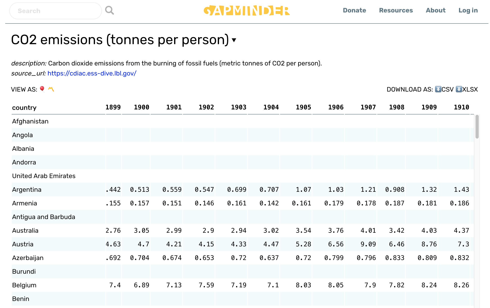

# Avoiding Mistakes When Citing Sources {#citmistakes515}

When grading students' reports we see certain mistakes related to citations come up again and again. 

## Improperly Citing Online Sources

These are the most frequent mistakes we see. Nearly all students now use web versions of print sources and online-only sources exclusively. Very few students use hard copy print sources anymore. Easy access to online sources is good in that you can access more information than ever before. The problem is that many students cite sources they obtained from the web incorrectly. 

Depending on your school's academic honesty policies, incorrect citations may be considered plagiarism, because you are mis-representing the sources of your information. At the least your report will earn a much lower grade than it would have gotten if you cited your web sources properly. 

The most common mistake we see is using just the URL, link, or DOI for an article as a citation. __This is not acceptable in scientific writing.__ Never use just the URL from a Pubmed, Web of Science, or Google Scholar page, or a DOI link on its own to identify or cite a source. A valid citation for an electronic source still has the names of the authors, name of the resource, and when and where it was accessed.

## Using Unreliable Web Sources

This is the other common mistake we see students make. Electronic sources need to be peer reviewed, and preferably primary sources. 

### What You Can Use Safely

In general, you can safely use electronic materials obtained from official publications of government agencies like NIH, USDA, or NSF. Their site URLs usually end with “.gov”. 

Web sites of scholarly research projects associated with a research institution or university are acceptable sources, but should never be the sole source of information. 

Web pages that provide numbers, facts, or summary data are acceptable IF they document the source of the data they provide. For example, the image below is a table of CO2 emissions for a subset of countries taken from Gapminder.org. 

In the upper left of the image they provide the source of the data shown in the table. This would be a reasonable web source to cite if you wanted to support a statement about differences in growth of carbon emissions in Argentina versus Belgium in the first decade of the 20th century. 

### What You Should Not Use 

General access web pages are not acceptable sources because the content is not peer reviewed for accuracy by subject matter experts. Wikipedia should not be used as a sources for that reason.

> Wikipedia CAN be a good resource, if you use it wisely. For example, a Wikipedia page can give you a general overview of a difficult topic (say, how yeast control their cell cycle) so you have a framework of knowledge on which to build. Also, more technical Wikipedia articles may have primary literature for some of the references. Track down the original articles and see if they meet the criteria for primary literature. If they do, they might be more suitable sources for your report or other assignment. 

## Other Common Mistakes
### Misusing Quotes From Sources

Teachers have differing policies on how long quotes can be before they are considered plagiarism, and disagree on how to format and properly cite them. This led to a lot of confusion for our students, and report grades suffered. After struggling with this for many years, we found a simple solution to the problem. We have a blanket requirement: 

__"Everyone has to paraphrase their sources. No quotes longer than 3 words are allowed in lab reports. Period."__

This might seem harsh, but think about it: if you can never quote a source, you spend less time worrying about whether or not you formatted the quote right, or whether it is below the word limit to be called plagiarism. You spend your time and mental energy practicing paraphrasing sources instead. We found this stricter rule meant FEWER students made mistakes in how they quoted sources; we did not have to count off for it, and our students got higher scores on lab reports.

Even if your instructor allows quotes, we recommend avoiding them unless __absolutely__ necessary.

### Padding the Literature Cited

Never list references in the Literature Cited that are not used in the text of a report. Every in-text citation should be in the Literature Cited, and vice versa. Failing to list all cited sources properly is a form academic dishonesty.

### Using the Wrong Format

Make sure you know which citation format you are expected to use, and follow it. Better still, use a citation manager program to do the work for you. We can overlook minor errors like a misplaced comma, but omitting important information is more serious. Omitting essential citation information is the same as not citing the source at all.

### Using an Irrelevant Source

Make sure that each source you use and cite actually says what you claim it does. We understand students get short on time. When your deadline is looming, it is tempting to find a source that sounds like it supports your argument, and add it without actually reading the source. This is much more likely to hurt than help you. 

For example, some time back one of our students used a citation from 1951 to support a statement about plant population growth in the Discussion section of their report. Their GTA was suspicious, and looked up the 1951 article. It turned out that the article the student cited was about human population growth and focused on agricultural economics, not biology. The student confessed that they had not read the source, and added it simply because the phrase "population growth" was in the description in Google Scholar. The student received a zero on the report for padding their Literature Cited section, which they could have avoided by taking 5 minutes to skim the actual article. 
