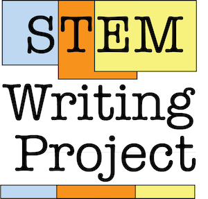

--- 
title: "Biology Student Writing Guide"
author: "STEM Writing Project"
date: "2022-07-11"
site: bookdown::bookdown_site
output: bookdown::gitbook
documentclass: book
bibliography: [book.bib, packages.bib]
biblio-style: apalike
link-citations: yes
github-repo: adanieljohnson/SWP_writing_guide
description: "This is an open-access web book for biology students starting out in scientific writing. We developed and released it on a open platform so teachers can modify it to meet their particular needs. "
favicon: <"images/favicon.ico">
cover-image: images/SWP_logo.png
url: https\://github.com/adanieljohnson/SWP_student_writing_guide/
---
#  {-}

This compilation work is licensed under a [Creative Commons Attribution-NonCommercial-ShareAlike 4.0 International License](http://creativecommons.org/licenses/by-nc-sa/4.0/). Photos, artwork and text that are not original to this compilation are marked with their Creative Commons or similar licenses, and should not be re-used without appropriate attribution. 

