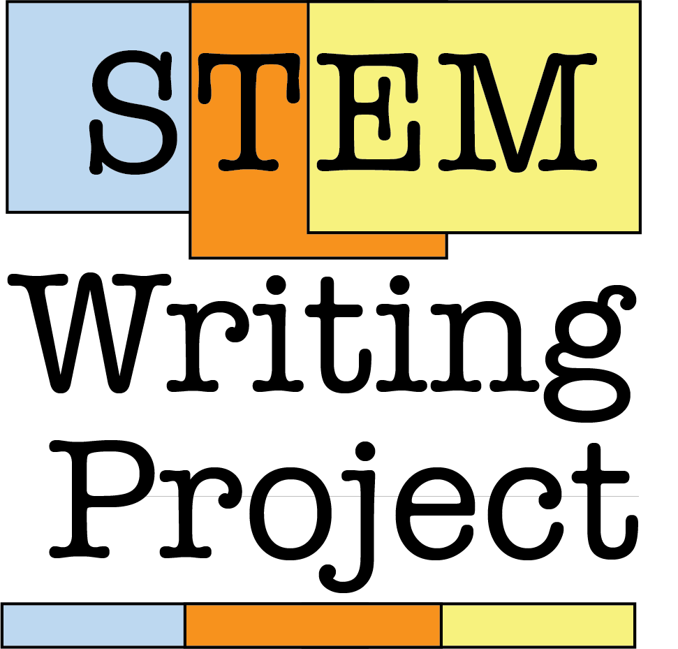

--- 
title: "Biology Student Writing Guide"
author: "STEM Writing Project"
date: "`r Sys.Date()`"
site: bookdown::bookdown_site
output: bookdown::gitbook
documentclass: book
bibliography: [book.bib, packages.bib]
biblio-style: apalike
link-citations: yes
github-repo: adanieljohnson/SWP_writing_guide
description: "This is an open-access web book for biology students starting out in scientific writing. We developed and released it on a open platform so teachers can modify it to meet their particular needs. "
favicon: <"images/favicon.ico">
cover-image: images/SWP_logo.png
github-repo: adanieljohnson/SWP
url: https\://github.com/adanieljohnson/SWP/
---
#  {-}

This work is licensed under a [Creative Commons Attribution-NonCommercial-ShareAlike 4.0 International License](http://creativecommons.org/licenses/by-nc-sa/4.0/). All photos and other artwork that is not original remains under its respective original Creative Commons or similar licenses. 

 This work is licensed under a <a rel="license" href="http://creativecommons.org/licenses/by-nc-sa/4.0/">Creative Commons Attribution-NonCommercial-ShareAlike 4.0 International License</a>.

